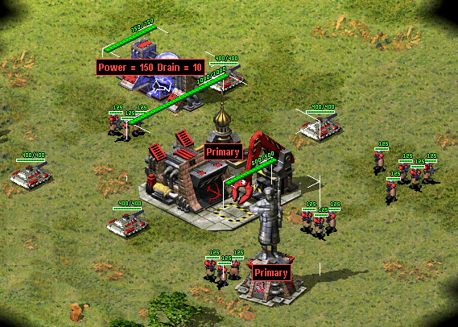
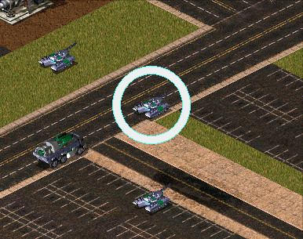
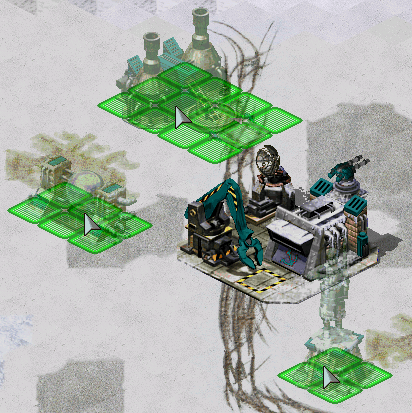
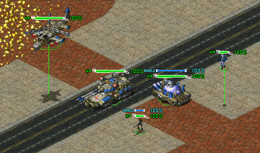
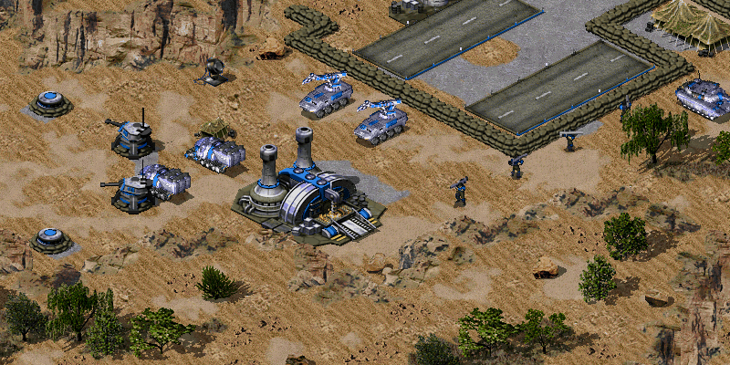
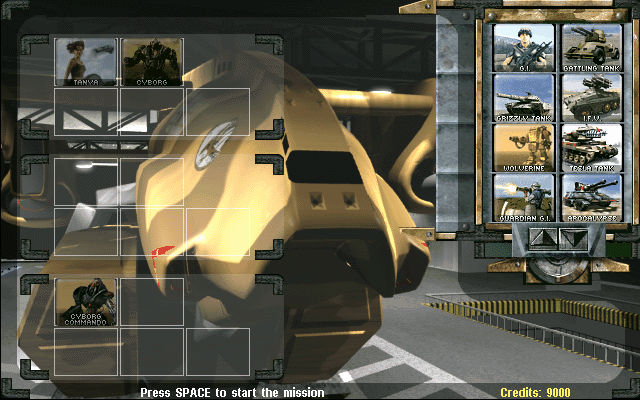
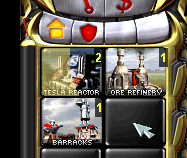
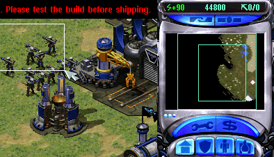
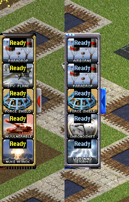

# User Interface

This page lists all user interface additions, changes, fixes that are implemented in Phobos.

## Bugfixes and miscellanous

- Enabled ability to load full-color non-paletted PCX graphics of any bitness. This applies to every single PCX file that is loaded, including the Ares-supported PCX files.
- You can specify custom `gamemd.exe` icon via `-icon` command line argument followed by absolute or relative path to an `*.ico` file (f. ex. `gamemd.exe -icon Resources/clienticon.ico`).
- Fixed `Blowfish.dll`-caused error `***FATAL*** String Manager failed to initialize properly`, which occurred if `Blowfish.dll` could not be registered in the OS, for example, it happened when the player did not have administrator rights. With Phobos, if the game did not find a registered file in the system, it will no longer try to register this file, but will load it bypassing registration.
- Fixed non-IME keyboard input to be working correctly for languages / keyboard layouts that use character ranges other than Basic Latin and Latin-1 Supplement (font support required).
- Fixed position and layer of info tip and reveal production cameo on selected building.
- Timer (superweapon, mission etc) blinking color scheme can be customized by setting `[AudioVisual] -> TimerBlinkColorScheme`. Defaults to third color scheme listed in `[Colors]`.
- Fixed sidebar not updating queued unit numbers when adding or removing units when the production is on hold.
- Increased cursor update frequency by setting interval to 1ms instead of 16ms.

```{note}
You can use the improved vanilla font which can be found on [Phobos supplementaries repo](https://github.com/Phobos-developers/PhobosSupplementaries) which has way more Unicode character coverage than the default one.
```

## Audio

- You can now specify which soundtrack themes would play on win or lose.

In `rulesmd.ini`:
```ini
[SOMESIDE]              ; Side
IngameScore.WinTheme=   ; Soundtrack theme ID
IngameScore.LoseTheme=  ; Soundtrack theme ID
```

### New EVA voice after deploying a building

- You can now replace the current EVA voice when a specific building is placed/deployed.
- If any building is undeployed/sold/destroyed, the EVA voice will be evaluated again across all active player buildings defining `NewEVAVoice.Tag`.
- `NewEVAVoice.Tag` specifies the EVA voice name (defined under `[EVATypes]` in `evamd.ini` via Ares, or vanilla voices `Allied`, `Russian`, `Yuri`).
- In case of multiple buildings with different EVA voices, `NewEVAVoice.Priority` establishes a priority queue, where the building with the highest value is selected.
- `NewEVAVoice.RecheckOnDeath` controls whether to re-evaluate the active EVA voice upon building destruction or sale.
- `NewEVAVoice.InitialMessage` plays an EVA sound message to the player when a new EVA voice is activated.
- `NewEVAVoice.EndingMessage` plays an EVA sound message / sound effect with the outgoing EVA voice when it is deactivated/replaced before transitioning to the new voice.
- When no buildings with `NewEVAVoice` remain, the EVA voice automatically falls back hierarchically:
  1. `[HouseType] -> EVA.Tag` (Country-specific EVA voice)
  2. `[Side] -> EVA.Tag` (Side-specific EVA voice)
  3. Default vanilla voice according to side index (Allied, Russian, Yuri)

In `rulesmd.ini`:
```ini
[SOMESIDE]                        ; Side
EVA.Tag=                          ; EVA type name from [EVATypes] or Allied/Russian/Yuri

[SOMEBUILDING]                    ; BuildingType
NewEVAVoice.Tag=                  ; EVA type name from [EVATypes] or Allied/Russian/Yuri
NewEVAVoice.Priority=1            ; integer
NewEVAVoice.RecheckOnDeath=false  ; boolean
NewEVAVoice.InitialMessage=       ; EVA entry
NewEVAVoice.EndingMessage=        ; EVA entry
```

## Battle screen UI/UX

### Allow chat box in singleplayer

- In vanilla, the in-game chat box is disabled in singleplayer scenarios. You can now enable it by setting `[General] -> AllowChatBoxInSinglePlayer` to true.

In `rulesmd.ini`:
```ini
[General]
AllowChatBoxInSinglePlayer=false  ; boolean
```

### Allow draw SuperWeapon timer as percentage

- Superweapon cd timer can now draw as percentage.

In `rulesmd.ini`:
```ini
[AudioVisual]
SuperWeaponTimer.Percentage=false  ; boolean

[SOMESW]                           ; SuperWeaponType, with ShowTimer=yes
ShowTimer.Percentage=              ; boolean
```

### Custom health bars display


*Health bars hidden in [CnC: Final War](https://www.moddb.com/mods/cncfinalwar)*

- Health bar display can now be turned off as needed, hiding both the health bar box and health pips.
  - `HealthBar.HidePips` only hides the health bar without affecting anything else.
  - `HealthBar.Permanent` will display health points at all times.
  - `HealthBar.Permanent.PipScale` will always display additional pips and group numbers.

In `rulesmd.ini`:
```ini
[SOMETECHNO]                         ; TechnoType
HealthBar.Hide=false                 ; boolean
HealthBar.HidePips=false             ; boolean
HealthBar.Permanent=false            ; boolean
HealthBar.Permanent.PipScale=false   ; boolean
```

### Custom in-game font

- You can now customize the in-game font file (`GAME.FNT`) by specifying a custom font name.
  - `GameFont` specifies the filename of the `.fnt` font file to load instead of `GAME.FNT`.

In `uimd.ini`:
```ini
[UISettings]
GameFont=              ; string, filename of a custom .fnt font file (e.g. MYFONT.FNT), default to GAME.FNT
```

### Customize the step limit of the credits indicator

- In vanilla, the Credits Indicator in the sidebar increases by at most 143 points per frame, and now you can customize this limit.
  - If set to a value less than or equal to 0, the upper limit will be removed.

In `uimd.ini`:
```ini
[Sidebar]
CreditsIndicator.MaxStep=143  ; integer
```

```{note}
The game first takes the absolute value of the difference between the actual credits and the current value, then divides it by 8, and then clamps this value to the limit set here. If you wish to disable this smoothing effect, set [`CreditsIndicator.Smooth=false`](User-Interface.md#disable-the-credits-indicator-smooth-transition).
```

### Digital display


*Default configuration of digital display using example shapes from [Phobos supplementaries](https://github.com/Phobos-developers/PhobosSupplementaries).*

- You can now configure various types of numerical counters to be displayed over Techno to represent its attributes, such as health points or shield points and can be turned on or off via a [new hotkey](#toggle-digital-display).
  - `InfoIndex` defines the specific `InfoType`.
    - In `InfoType=Spawns`,
      - 0 - alive spawns,
      - 1 - docked spawns,
      - 2 - launching spawns.
      <br><br>
    - In `InfoType=Tiberium`,
      - 0 - all,
      - 1 - the first tiberium,
      - 2 - the second tiberium,
      <br>...
    - In `InfoType=SpawnTimer`,
      - 0 - the fastest spawnee,
      - 1 - the first spawnee,
      - 2 - the second spawnee,
      <br>...
    - In `InfoType=SuperWeapon`,
      - 0 - the first SW of all,
      - 1 - `[BuildingType] -> SuperWeapon`,
      - 2 - `[BuildingType] -> SuperWeapon2`,
      - 3 - the first SW in `[BuildingType] -> SuperWeapons`,
      <br>...
    - In `InfoType=FactoryProcess`,
      - 0 - the first factory in production,
      - 1 - primary factory,
      - 2 - secondary factory.
      <br><br>
  - `Anchor.Horizontal` and `Anchor.Vertical` set the anchor point from which the display is drawn (depending on `Align`) relative to unit's center/selection box. For buildings, `Anchor.Building` is used instead.
    - `Offset` and `Offset.ShieldDelta` (the latter applied when a shield is active) can be used to further modify the position.
  - By default, values are displayed in `current/maximum` format (i.e. `20/40`).
    - `HideMaxValue=yes` will make the counter show only the current value (i.e. `20`), default to whether the techno is infantry or not.
    - `Percentage=yes` changes the format to `percent%` (i.e. `50%`).
    - `ValueAsTimer` controls whether the value will be displayed in the form of a timer (i.e. `0:30`, `5:00` or `1:00:00`).
  - `VisibleToHouses` and `VisibleToHouses.Observer` can limit visibility to specific players.
    - `VisibleInSpecialState` controls whether this display type will show when the owner is in ironcurtain or is attacked by a temporal weapon.
  - The digits can be either a custom shape (.shp) or text drawn using the game font. This depends on whether `Shape` is set.
    - `Text.Color`, `Text.Color.ConditionYellow` and `Text.Color.ConditionRed` allow customization of the font color. `Text.Background=yes` will additionally draw a black rectangle background.
    - When using shapes, a custom palette can be specified with `Palette`. `Shape.Spacing` controls pixel buffer between characters. If `Shape.PercentageFrame` set to true, it will only draw one frame that corresponds to total frames by percentage.
    - Frames 0-9 will be used as digits when the owner's health bar is green, 10-19 when yellow, 20-29 when red. For `/` and `%` (or `:` if set `ValueAsTimer` to true) characters, frame numbers are 30-31, 32-33, 34-35, respectively.
  - Default `Offset.ShieldDelta` for `InfoType=Shield` is `0,-10`, `0,0` for others.
  - Default `Shape.Spacing` for buildings is `4,-2`, `4,0` for others.
  - `ValueScaleDivisor` can be used to adjust scale of displayed values. Both the current & maximum value will be divided by the integer number given, if higher than 1. Default to 1 (or 15 when set `ValueAsTimer` to true).

  - `DigitalDisplay.Health.FakeAtDisguise`, if set to true on an InfantryType with Disguise, will use the disguised TechnoType's `Strength` value as the maximum value of health display. The current value will be displayed as the percentage of its current health multiplies the new maximum value.
  - `ShowType` specifies the conditions under which it can be displayed. Note that `idle` is only available when `HealthBar.Permanent=yes`.

In `rulesmd.ini`:
```ini
[DigitalDisplayTypes]
0=SOMEDIGITALDISPLAYTYPE

[AudioVisual]
Buildings.DefaultDigitalDisplayTypes=          ; List of DigitalDisplayTypes
Infantry.DefaultDigitalDisplayTypes=           ; List of DigitalDisplayTypes
Vehicles.DefaultDigitalDisplayTypes=           ; List of DigitalDisplayTypes
Aircraft.DefaultDigitalDisplayTypes=           ; List of DigitalDisplayTypes
DigitalDisplay.Health.FakeAtDisguise=true      ; boolean

[SOMEDIGITALDISPLAYTYPE]                       ; DigitalDisplayType
; Generic
InfoType=Health                                ; Displayed value enumeration (Health|Shield|Ammo|Mindcontrol|Spawns|Passengers|Tiberium|Experience|Occupants|GattlingStage|ROF|Reload|SpawnTimer|GattlingTimer|ProduceCash|PassengerKill|AutoDeath|SuperWeapon|IronCurtain|TemporalLife|FactoryProcess)
InfoIndex=                                     ; integer
Offset=0,0                                     ; integers - horizontal, vertical
Offset.ShieldDelta=                            ; integers - horizontal, vertical
Align=right                                    ; Text alignment enumeration (left|right|center/centre)
Anchor.Horizontal=right                        ; Horizontal position enumeration (left|center/centre|right)
Anchor.Vertical=top                            ; Vertical position enumeration (top|center/centre|bottom)
Anchor.Building=top                            ; Hexagon vertex enumeration (top|lefttop|leftbottom|bottom|rightbottom|righttop)
Percentage=false                               ; boolean
HideMaxValue=false                             ; boolean
VisibleToHouses=owner                          ; Affected House Enumeration (none|owner/self|allies/ally|team|enemies/enemy|neutral|all)
VisibleToHouses.Observer=true                  ; boolean
VisibleInSpecialState=true                     ; boolean
ValueScaleDivisor=                             ; integer
ValueAsTimer=false                             ; boolean
ShowType=cursorhover,selected                  ; Displayed ShowType Enumeration (cursorhover|selected|idle|all)
; Text
Text.Color=0,255,0                             ; integers - Red, Green, Blue
Text.Color.ConditionYellow=255,255,0           ; integers - Red, Green, Blue
Text.Color.ConditionRed=255,0,0                ; integers - Red, Green, Blue
Text.Background=false                          ; boolean
; Shape
Shape=                                         ; filename with .shp extension, if not present, game-drawn text will be used instead
Palette=palette.pal                            ; filename with .pal extension
Shape.Spacing=                                 ; integers - horizontal, vertical spacing between digits
Shape.PercentageFrame=false                    ; boolean

[SOMETECHNO]                                   ; TechnoType
DigitalDisplay.Disable=false                   ; boolean
DigitalDisplayTypes=                           ; List of DigitalDisplayTypes
DigitalDisplay.Health.FakeAtDisguise=          ; boolean, default to [AudioVisual] -> DigitalDisplay.Health.FakeAtDisguise
```

In `RA2MD.INI`:
```ini
[Phobos]
DigitalDisplay.Enable=false                    ; boolean
```

```{note}
An example shape file for digits can be found on [Phobos supplementaries repo](https://github.com/Phobos-developers/PhobosSupplementaries).
```

````{note}
`Shape.PercentageFrame` effectively provides the ultimate solution for all static data display effects: it allows mapping the current value to a specific static frame index in a shape file sequence by calculating its proportional ratio to the total value, where the concrete image on this frame is entirely user-defined.

```{hint}
You can create a circular health bar for technos, where the different frames of this ring Shape file correspond to the state of the circular health bar at varying degrees of damage.


*Example of a ring-shaped health bar*

The arrangement of static images on the plane is entirely up to you to draw freely, without being constrained by pre-established frameworks (e.g., the original rule for health bars was to start at a fixed coordinate, fetch a pip from a fixed frame of a fixed file at fixed intervals, and then arrange them horizontally), choosing from inherently limited options.
```

Of course, this is just the implementation method. To balance freedom with efficiency - that is, how to efficiently draw the patterns you need - you still need to independently explore a workflow that suits you.
````

### Disable the credits indicator smooth transition

- In vanilla, the Credits Indicator has a smooth transition effect when the displayed credit value approaches the actual credit value. Now you can disable this effect, allowing the change step to always follow the value of [`CreditsIndicator.MaxStep`](User-Interface.md#customize-the-step-limit-of-the-credits-indicator).

In `uimd.ini`:
```ini
[Sidebar]
CreditsIndicator.Smooth=true  ; boolean
```

```{hint}
For example, if you want to make the credits update immediately without a transition process by setting `CreditsIndicator.MaxStep=0`, then you should also set `CreditsIndicator.Smooth=false`; otherwise, the displayed credit value will still change in the form of an exponential approximation function.
```

### Flashing Technos on selecting

- Selecting technos, controlled by player, now may show a flash effect by setting `SelectionFlashDuration` parameter higher than 0.
  - The feature can be toggled on/off by user if enabled in mod via `ShowFlashOnSelecting` setting in `RA2MD.INI`.

In `rulesmd.ini`:
```ini
[AudioVisual]
SelectionFlashDuration=0    ; integer, number of frames
```

In `RA2MD.INI`:
```ini
[Phobos]
ShowFlashOnSelecting=false  ; boolean
```

### Low priority for box selection


*Harvesters not selected together with battle units in [Rise of the East](https://www.moddb.com/mods/riseoftheeast)*

- You can now set lower priority for an ingame object (currently has effect on units mostly), which means it will be excluded from box selection if there's at least one normal priority unit in the box. Otherwise it would be selected as normal. Works with box+type selecting (type select hotkey + drag) and regular box selecting. Box shift-selection adds low-priority units to the group if there are no normal priority units among the appended ones.

In `rulesmd.ini`:
```ini
[SOMETECHNO]                ; TechnoType
LowSelectionPriority=false  ; boolean
```

- This behavior is designed to be toggleable by users. For now you can only do that externally via client or manually.

In `RA2MD.INI`:
```ini
[Phobos]
PrioritySelectionFiltering=true  ; boolean
```

### Observer UI

- An in-game Observer / Spectator UI that renders real-time game state information.
- Displays useful player information and game statistics in campaign and multiplayer.
- When `DebugKeysEnabled=yes` under `[GlobalControls]` in `rulesmd.ini`, all houses with active objects on the map are listed across all game modes for developer inspection.
- Supports floating inspection cards to display detailed object and AI debug information.
- Structures lacking a cameo icon automatically display a centered sprite preview with player faction remap and a transparent background.
- Structures with cash production (`ProduceCashAmount` and `ProduceCashDelay`) show their production rate per minute (`Income: +$X / min`).
- Structures and harvester units with storage capacity show their current and maximum storage (`Storage: X / Y`), along with a breakdown of stored resource types and quantities. (For refineries and resource destinations, this is enabled when `Refinery.UseStorage=yes`).
- All interface texts can be localized via `.csf` string table keys:

  | CSF String Key | Default Text |
  |---|---|
  | `TXT_TOGGLE_OBSERVER_UI` | `Observer UI` |
  | `TXT_TOGGLE_OBSERVER_UI_DESC` | `Toggle Observer UI overlay display mode.` |
  | `TXT_SHOW_OBJECT_CARD` | `Observer UI - Add Card` |
  | `TXT_SHOW_OBJECT_CARD_DESC` | `Add floating info card window for hovered or selected object.` |
  | `TXT_CLEAR_OBSERVER_UI_CARDS` | `Observer UI - Clear Cards` |
  | `TXT_CLEAR_OBSERVER_UI_CARDS_DESC` | `Clear all open floating info card windows.` |
  | `TXT_OBSERVER_FILTER_PLACEHOLDER` | `Filter...` |
  | `TXT_OBSERVER_TOOLTIP_INSPECT` | `Inspect Selected Object (Create Card)` |
  | `TXT_OBSERVER_PLAYER_PREFIX` | `P` |
  | `TXT_OBSERVER_TAB_DEFENSES` | `Defenses` |
  | `TXT_OBSERVER_TAB_STRUCTURES` | `Structures` |
  | `TXT_OBSERVER_TAB_ALL_STRUCTURES` | `All Structures` |
  | `TXT_OBSERVER_TAB_INFANTRY` | `Infantry` |
  | `TXT_OBSERVER_TAB_VEHICLES` | `Vehicles` |
  | `TXT_OBSERVER_TAB_NAVAL` | `Naval` |
  | `TXT_OBSERVER_TAB_AIRCRAFT` | `Aircraft` |
  | `TXT_OBSERVER_TAB_ALL_UNITS` | `All Units` |
  | `TXT_OBSERVER_TAB_SUPERWEAPONS` | `Superweapons` |
  | `TXT_OBSERVER_TAB_EVERYTHING` | `Everything` |
  | `TXT_OBSERVER_CARD_HP` | `HP: ` |
  | `TXT_OBSERVER_CARD_SHIELD` | `Shield: ` |
  | `TXT_OBSERVER_CARD_COORDS` | `Coords: ` |
  | `TXT_OBSERVER_CARD_MISSION` | `Mission: ` |
  | `TXT_OBSERVER_CARD_TARGET` | `Target: ` |
  | `TXT_OBSERVER_CARD_DESTINATION` | `Destination: ` |
  | `TXT_OBSERVER_CARD_DISTANCE` | `Distance: ` |
  | `TXT_OBSERVER_CARD_CELLS` | ` cells` |
  | `TXT_OBSERVER_CARD_AMMO` | `Ammo: ` |
  | `TXT_OBSERVER_CARD_VETERANCY` | `Veterancy: ` |
  | `TXT_OBSERVER_CARD_PASSENGERS` | `Passengers` |
  | `TXT_OBSERVER_CARD_GARRISONED` | `Garrisoned` |
  | `TXT_OBSERVER_CARD_INCOME` | `Income: ` |
  | `TXT_OBSERVER_CARD_STORAGE` | `Storage: ` |
  | `TXT_OBSERVER_CARD_BUILD_TIME` | `Build Time: ` |
  | `TXT_OBSERVER_CARD_COST` | `Cost: ` |
  | `TXT_OBSERVER_CARD_LAST_PRODUCED` | `Last Produced:` |
  | `TXT_OBSERVER_CARD_DESTROYED` | `Destroyed` |
  | `TXT_OBSERVER_CARD_TEAM` | `Team: ` |
  | `TXT_OBSERVER_CARD_TASKFORCE` | `Taskforce: ` |
  | `TXT_OBSERVER_CARD_SCRIPT` | `Script: ` |
  | `TXT_OBSERVER_CARD_SCRIPT_DATA` | `Script Line: ` |
  | `TXT_OBSERVER_NONE` | `None` |

### Placement preview


*Building placement preview using 50% translucency in [Rise of the East](https://www.moddb.com/mods/riseoftheeast)*

- Building previews can now be enabled when placing a building for construction. This can be enabled on a global basis with `[AudioVisual] -> PlacementPreview` and then further customized for each building with `[BuildingType] -> PlacementPreview`.
- The building placement grid (`place.shp`) translucency setting can be adjusted via `PlacementGrid.Translucency` if `PlacementPreview` is disabled and `PlacementGrid.TranslucencyWithPreview` if enabled.
- If using the building's appropriate `Buildup` is not desired, customizations allow for you to choose the exact SHP and frame you'd prefer to show as preview through `PlacementPreview.Shape`, `PlacementPreview.ShapeFrame` and `PlacementPreview.Palette`.
  - You can specify theater-specific palettes and shapes by putting three `~` marks to the theater specific part of the filename. `~~~` is replaced with the theater's three-letter extension.
- `PlacementPreview.ShapeFrame` tag defaults to building's artmd.ini `Buildup` entry's last non-shadow frame. If there is no 'Buildup' specified it will instead attempt to default to the building's normal first frame (animation frames and bibs are not included in this preview).

In `rulesmd.ini`:
```ini
[AudioVisual]
PlacementPreview=no                     ; boolean
PlacementPreview.Translucency=75        ; translucency level (0/25/50/75)
PlacementGrid.Translucency=0            ; translucency level (0/25/50/75)
PlacementGrid.TranslucencyWithPreview=  ; translucency level (0/25/50/75), defaults to [AudioVisual] -> PlacementGrid.Translucency

[SOMEBUILDING]                          ; BuildingType
PlacementPreview=yes                    ; boolean
PlacementPreview.Shape=                 ; filename - including the .shp extension. If not set uses building's artmd.ini Buildup SHP (based on Building's Image)
PlacementPreview.ShapeFrame=            ; integer, zero-based frame index used for displaying the preview
PlacementPreview.Offset=0,-15,1         ; integer, expressed in X,Y,Z used to alter position preview
PlacementPreview.Remap=yes              ; boolean, does this preview use player remap colors
PlacementPreview.Palette=               ; filename - including the .pal extension
PlacementPreview.Translucency=          ; translucency level (0/25/50/75), defaults to [AudioVisual] -> PlacementPreview.Translucency
```

```{note}
The `PlacementPreview.Palette` option is not used when `PlacementPreview.Remap` is set to yes. This may change in future.
```

- This behavior is designed to be toggleable by users. For now you can only do that externally via client or manually.

In `RA2MD.INI`:
```ini
[Phobos]
ShowPlacementPreview=yes   ; boolean
```

### Real time timers

- Timers can now display values in real time, taking game speed into account. This can be enabled with `RealTimeTimers=true`.
- By default, time is calculated relative to desired framerate. Enabling `RealTimeTimers.Adaptive` (always true for unlimited FPS and custom speeds) will calculate time relative to *current* FPS, accounting for lag.
  - When playing with unlimited FPS (or custom speed above 60 FPS), the timers might constantly change value because of the unstable nature.
- This option respects custom game speeds.

- This behavior is designed to be toggleable by users. For now you can only do that externally via client or manually.

In `RA2MD.INI`:
```ini
[Phobos]
RealTimeTimers=false            ; boolean
RealTimeTimers.Adaptive=false   ; boolean
```

### Select Box


*SelectBox and GroundLine in **Solar Flare** by [Netsu_Negi](https://space.bilibili.com/26486915/lists/3151060)*

- Now you can use and customize select box for infantry, vehicle and aircraft. No select box for buildings in default case, but you still can specific for some building if you want.
  - `Frames` can be used to list frames of `Shape` file that'll be drawn as a select box when the TechnoType's health is at or below full health/the percentage defined in `[AudioVisual] -> ConditionYellow/ConditionRed`, respectively.
  - Select box's translucency setting can be adjusted via `Translucency`.
  - `VisibleToHouses` and `VisibleToHouses.Observer` can limit visibility to specific players.
  - `DrawAboveTechno` specific whether the select box will be drawn before drawing the TechnoType. If set to false, the select box can be obscured by the TechnoType, and the draw location will ignore `PixelSelectionBracketDelta`.
  - You can now use `GroundShape` to specific a image which always draw on ground, it will only draw when techno is in air if set `Ground.AlwaysDraw=false`, this also affect on `GroundLine`.
  - If `GroundLine=true`, the game will draw a line from techno's position to its vertical projection, `GroundLine.Dashed=true` means the projection line is a dashed line.

In `rulesmd.ini`:
```ini
[SelectBoxTypes]
0=SOMESELECTBOXTYPE

[AudioVisual]
DefaultInfantrySelectBox=               ; Select box for infantry
DefaultUnitSelectBox=                   ; Select box for vehicle and aircraft

[SOMESELECTBOXTYPE]                     ; Select box Type name
Shape=                                  ; filename with .shp extension
Palette=palette.pal                     ; filename with .pal extension
Frames=                                 ; List of integer, default 1,1,1 for infantry, 0,0,0 for vehicle and aircraft
Offset=0,0                              ; integers - horizontal, vertical
Translucency=0                          ; translucency level (0/25/50/75)
VisibleToHouses=all                     ; Affected House Enumeration (none|owner/self|allies/ally|team|enemies/enemy|neutral|all)
VisibleToHouses.Observer=true           ; boolean
DrawAboveTechno=true                    ; boolean
GroundShape=                            ; filename with .shp extension
GroundPalette=palette.pal               ; filename with .pal extension
GroundFrames=                           ; List of integer, default 1,1,1 for infantry, 0,0,0 for vehicle and aircraft
GroundOffset=0,0                        ; integers - horizontal, vertical
Ground.AlwaysDraw=true                  ; boolean
GroundLine=false                        ; boolean
GroundLineColor=0,255,0                 ; R, G, B
GroundLineColor.ConditionYellow=        ; R, G, B
GroundLineColor.ConditionRed=           ; R, G, B
GroundLine.Dashed=false                 ; boolean

[SOMETECHNO]                            ; TechnoType
SelectBox=                              ; Select box
HideSelectBox=false                     ; boolean
```

In `RA2MD.INI`:
```ini
[Phobos]
EnableSelectBox=false                   ; boolean
```

```{warning}
- For your shp to work properly, you need to save it in `Force Compression 3` mode, otherwise it might be incorrectly rendered as something similar to AlphaImage.
- For ImageShaper users, you need to choose a mode other than `Uncompressed` or `Uncompressed_Full_Frame` to create `*.shp` files.
```

### Set sidebar tab by selecting factory

- You can choose the corresponding type of factory to switch the sidebar tab by setting `SetTabBySelectingFactory=true`.
  - `SetTabBySelecting` can be used to define which tab to switch to when this building (which need not be a factory) is selected.
    - Normal values: 0 (buildings tab), 1 (arsenal tab), 2 (infantry tab), 3 (vehicle tab).
    - Negative values: automatically match according to the selected building's `Factory`. For `Factory=BuildingType`, if the current tab is 0, switch to 1; otherwise switch to 0.
    - Other values (values greater than or equal to 4): do nothing, i.e., disable this effect.

In `rulesmd.ini`:
```ini
[General]
SetTabBySelectingFactory=false  ; boolean

[SOMEBUILDING]                  ; BuildingType
SetTabBySelecting=-1            ; integer, index of tab
```

### Show designator & inhibitor range

- It is now possible to display range of designator and inhibitor units when in super weapon targeting mode. Each instance of player owned techno types listed in `[SuperWeapon] -> SW.Designators` will display a circle with radius set in `[TechnoType] -> DesignatorRange` or `Sight`.
  - In a similar manner, each instance of enemy owned techno types listed in `[SuperWeapon] -> SW.Inhibitors` will display a circle with radius set in `[TechnoType] -> InhibitorRange` or `Sight`.
- This feature can be disabled globally with `[AudioVisual] -> ShowDesignatorRange=false` or per SuperWeaponType with `[SuperWeapon] -> ShowDesignatorRange=false`.
- This feature can be toggled *by the player* (if enabled in the mod) with `ShowDesignatorRange` in `RA2MD.INI` or with ["Toggle Designator Range" hotkey](#toggle-designator-range) in "Interface" category.

In `rulesmd.ini`:
```ini
[AudioVisual]
ShowDesignatorRange=true    ; boolean

[SOMESW]                    ; SuperWeaponType
ShowDesignatorRange=true    ; boolean
```

In `RA2MD.INI`:
```ini
[Phobos]
ShowDesignatorRange=false             ; boolean
```

### Show game time

- A timer can be displayed to show how many time has passed since game starts.
  - Both `[Phobos] -> ShowGameTime` and `[General] -> ShowGameTime` need to be set to true to enable the timer.
  - The timer will be shown in the format of `TXT_GAMETIME hh:mm:ss`. For localization add `TXT_GAMETIME` into your `.csf` file.
  - `ShowGameTime.BoardOpacity` can be used to set the opacitiy of background for game time display.
  - Observer can't see this timer since they've already gotten one on the top of sidebar.

In `rulesmd.ini`:
```ini
[General]
ShowGameTime=true              ; boolean
```

In `RA2MD.INI`:
```ini
[Phobos]
ShowGameTime=false             ; boolean
ShowGameTime.BoardOpacity=40   ; integer
```

### Show power plant enhancer range

- It is possible to show range of power plant enhancer when placing a building.

In `rulesmd.ini`:
```ini
[AudioVisual]
ShowPowerPlantEnhancerRange=true   ; boolean
```

In `RA2MD.INI`:
```ini
[Phobos]
ShowPowerPlantEnhancerRange=false  ; boolean
```

### SuperWeapon ShowTimer sorting

- You can now sort the timers of superweapons in ascending order from top to bottom according to a given priority value.

In `rulesmd.ini`:
```ini
[SOMESW]              ; SuperWeaponType, with ShowTimer=yes
ShowTimer.Priority=0  ; integer
```

### Task subtitles display in the middle of the screen


*Taking a campaign in [Mental Omega](https://www.mentalomega.com) as an example to display messages in center*

- Now you can set `MessageApplyHoverState` to true，to make the upper left messages not disappear while mouse hovering over the top of display area.
- You can also let task subtitles (created by trigger 11) to display directly in the middle area of the screen instead of the upper left corner, with a semi transparent background, by setting `MessageDisplayInCenter` to true. In this case, all messages within this game can be saved, even after being s/l. The storage capacity of messages can reach thousands.
  - If you also set `MessageApplyHoverState` to true, when the mouse hovers over the subtitle area (simply judged as a rectangle), its opacity will increase and it will not disappear during this period. If the area is expanded, disabling this option will not prevent mouse clicking behavior from being restricted to this area.
  - `MessageDisplayInCenter.BoardOpacity` controls the opacity of the background.
  - `MessageDisplayInCenter.LabelsCount` controls the maximum number of subtitle labels that can automatically pop up at a same time in the middle area of the screen. At least 1.
  - `MessageDisplayInCenter.RecordsCount` controls the maximum number of historical messages displayed when this middle area is expanded (not the maximum number that can be stored). At least 4, and it is 8 in the demonstration gif.
  - The label can be toggled by ["Toggle Message Label" hotkey](#toggle-message-label) in "Interface" category.

In `RA2MD.INI`:
```ini
[Phobos]
MessageApplyHoverState=false            ; boolean
MessageDisplayInCenter=false            ; boolean
MessageDisplayInCenter.BoardOpacity=40  ; integer
MessageDisplayInCenter.LabelsCount=6    ; integer
MessageDisplayInCenter.RecordsCount=12  ; integer
```

### Type select for buildings

- In vanilla game, type select can almost only be used on 1x1 buildings with `UndeploysInto`. Now it's possible to use it on all buildings if `BuildingTypeSelectable` set to true.

```{note}
In Vanilla, you can type select a building by holding down the T key in advance and then clicking on the building. However, other type selection methods (such as selecting a building first and then pressing the T key, or selecting a building first and then pressing the type select button in the bottom sidebar) are not valid for buildings.
```

In `rulesmd.ini`:
```ini
[General]
BuildingTypeSelectable=false  ; boolean
```

```{warning}
Due to technical limitations, this feature is forcibly disabled without Ares.
```

### Visual effects toggling

- It is possible to toggle certain light flash effects off. These light flash effects include:
  - Combat light effects (`Bright=true`) and everything that uses same functionality e.g Iron Curtain / Force Field impact flashes.
  - Alpha images attached to ParticleSystems or Particles that are generated through a Warhead's `Particle` if `[AudioVisual] -> WarheadParticleAlphaImageIsLightFlash` or on Warhead `Particle.AlphaImageIsLightFlash` is set to true, latter defaults to former.
    - Additionally these alpha images are not created if `[AudioVisual] -> LightFlashAlphaImageDetailLevel` is higher than current detail level, regardless of the `HideLightFlashEffects` setting.
- It is possible to toggle shake screen effects (`ShakeX/Ylo/hi`) off by setting `HideShakeEffects=true`.
- Phobos's [Laser Trail effects](New-or-Enhanced-Logics.md#laser-trails) can also be toggled off.
  - If a LaserTrailType has `IsHideable=false`, it can't be toggled off by setting `HideLaserTrailEffects=true`.

In `rulesmd.ini`:
```ini
[AudioVisual]
WarheadParticleAlphaImageIsLightFlash=false  ; boolean
LightFlashAlphaImageDetailLevel=0            ; integer

[SOMEWARHEAD]                                ; WarheadType
Particle.AlphaImageIsLightFlash=             ; boolean
```

In `artmd.ini`:
```ini
[SOMETRAIL]                  ; LaserTrailType name
IsHideable=true              ; boolean
```

In `RA2MD.INI`:
```ini
[Phobos]
HideLightFlashEffects=false  ; boolean
HideLaserTrailEffects=false  ; boolean
HideShakeEffects=false       ; boolean
```

### Visual indication of income from grinders and refineries

- `DisplayIncome` can be set to display the amount of credits acquired when a building is grinding units / receiving ore dump from harvesters or slaves.
  - `DisplayIncome.Delay` is the interval in frames between two consecutive income displays, defaults to 15 (one in-game second on middle speed).
    - Multiple income within less than the time defined by `DisplayIncome.Delay` have their amounts coalesced into single display.
    - Delay cannot be set to 0, this will change the delay to 1 and outputs a developer warning to log.
  - `DisplayIncome.Houses` determines which houses can see the credits display.
    - If you don't want players to see how AI cheats with `VirtualPurifiers` for example, `DisplayIncome.AllowAI` can be set to false to disable the display. It overrides the previous option.
  - `DisplayIncome.Offset` is additional pixel offset for the center of the credits display, by default `0,0` at building's center.
  - `[AudioVisual] -> DisplayIncome` also allows to display the amount of credits when selling a unit on a repair bay.

In `rulesmd.ini`:
```ini
[AudioVisual]
DisplayIncome=false        ; boolean
DisplayIncome.Delay=15     ; integer
DisplayIncome.Houses=all   ; Affected House Enumeration (none|owner/self|allies/ally|team|enemies/enemy|neutral|all)
DisplayIncome.AllowAI=yes  ; boolean

[SOMEBUILDING]             ; BuildingType
DisplayIncome=             ; boolean, defaults to [AudioVisual] -> DisplayIncome
DisplayIncome.Delay=15     ; integer, defaults to [AudioVisual] -> DisplayIncome.Delay
DisplayIncome.Houses=      ; Affected House Enumeration, defaults to [AudioVisual] -> DisplayIncome.Houses
DisplayIncome.Offset=0,0   ; X,Y, pixels relative to default
```

### Show power plant enhancer range

- It is possible to show range of power plant enhancer when placing a building.

In `rulesmd.ini`:
```ini
[AudioVisual]
ShowPowerPlantEnhancerRange=true   ; boolean
```

In `RA2MD.INI`:
```ini
[Phobos]
ShowPowerPlantEnhancerRange=false  ; boolean
```

### Set sidebar tab by selecting factory

- You can choose the corresponding type of factory to switch the sidebar tab by setting `SetTabBySelectingFactory=true`.
  - `SetTabBySelecting` can be used to define which tab to switch to when this building (which need not be a factory) is selected.
    - Normal values: 0 (buildings tab), 1 (arsenal tab), 2 (infantry tab), 3 (vehicle tab).
    - Negative values: automatically match according to the selected building's `Factory`. For `Factory=BuildingType`, if the current tab is 0, switch to 1; otherwise switch to 0.
    - Other values (values greater than or equal to 4): do nothing, i.e., disable this effect.

In `rulesmd.ini`:
```ini
[General]
SetTabBySelectingFactory=false  ; boolean

[SOMEBUILDING]                  ; BuildingType
SetTabBySelecting=-1            ; integer, index of tab
```

### Tactical zoom

- Magnifies the battlefield tactical view using mouse wheel (`Ctrl + Wheel`) and configurable keyboard hotkeys.
  - `TacticalZoom` enables or disables tactical zoom.
  - `TacticalZoom.Scroll` enables mouse wheel zooming (`Ctrl + Wheel`) and middle click zoom reset.
  - `TacticalZoom.KeyEnabled` enables keyboard commands.
  - `TacticalZoom.Max` sets the maximum zoom magnification (e.g. `3.6` allows zooming in up to 3.6x).
  - `TacticalZoom.Step` sets the zoom increment per wheel notch or hotkey press.
  - `TacticalZoom.Smooth` toggles smooth frame-by-frame interpolation between zoom levels.

In `uimd.ini`:
```ini
[TacticalZoom]
TacticalZoom=false            ; boolean
TacticalZoom.Scroll=true      ; boolean
TacticalZoom.KeyEnabled=true  ; boolean
TacticalZoom.Max=3.6          ; double
TacticalZoom.Step=0.2         ; double
TacticalZoom.Smooth=true      ; boolean
```

In `RA2MD.INI`:
```ini
[Phobos]
TacticalZoom=true          ; boolean
TacticalZoom.Smooth=true   ; boolean
```

## Hotkey Commands

### `[ ]` Tactical Zoom Commands

- Allows zooming in, zooming out, or resetting the battlefield view magnification. Configurable under Interface options.
- Hotkeys are enabled when `TacticalZoom` and `TacticalZoom.KeyEnabled` are enabled in `uimd.ini`.
- For localization add `TXT_ZOOM_IN`, `TXT_ZOOM_IN_DESC`, `TXT_ZOOM_OUT`, `TXT_ZOOM_OUT_DESC`, `TXT_RESET_ZOOM`, and `TXT_RESET_ZOOM_DESC` into your `.csf` file.


### `[ ]` Cycle Selection

- Cycles through the objects that were selected when the cycle was started, selecting one of them at a time and wrapping around at the end of the list.
- The cycle is restarted from the beginning whenever the current selection changes, e.g. when another object is selected or the selection is cleared.
- If nothing is selected, `MSG:NothingSelected` is logged.
- Enable the hotkey by setting `CycleSelectionKeyEnabled` to true.
- For localization add `TXT_CYCLE_SELECTION` and `TXT_CYCLE_SELECTION_DESC` into your `.csf` file.

In `rulesmd.ini`:
```ini
[GlobalControls]
CycleSelectionKeyEnabled=true    ; boolean
```

### `[ ]` Cycle Type Selection

- Cycles through the types present in the selection the cycle was started with, selecting every object of one type at a time and wrapping around at the end of the type list.
- Type identity follows the game's own type selection: vanilla's Type ID, as extended by Ares's `GroupAs`.
- The cycle is restarted from the beginning whenever the current selection changes, e.g. when another object is selected or the selection is cleared.
- If nothing is selected, `MSG:NothingSelected` is logged.
- If `CycleTypeSelectionPrintSummary` is set to true, every step prints the same kind of selection summary the game's own type selection prints: the type's name, followed by the number of selected objects of that type and their total cost, formatted into the vanilla `MSG:UnitsWorth` string. The total cost is what the game itself adds up for that summary.
- Enable the hotkey by setting `CycleTypeSelectionKeyEnabled` to true.
- For localization add `TXT_CYCLE_TYPE_SELECTION` and `TXT_CYCLE_TYPE_SELECTION_DESC` into your `.csf` file.

The order in which the types are cycled to is customizable, and is decided by the following rules, in order:

1. Higher `TypeCyclePriority` wins.
2. Ties are broken by the type's `Cost`, from the highest to the lowest. The raw cost registered in the INI is used - never the cost the type currently has for the selecting player - so cost multipliers of the owning house do not affect the order.
3. Remaining ties are broken by the reversed INI load order: the type written further down in the INI is cycled to first.

In `rulesmd.ini`:
```ini
[GlobalControls]
CycleTypeSelectionKeyEnabled=true    ; boolean
CycleTypeSelectionPrintSummary=true  ; boolean

[SOMETECHNO]                         ; TechnoType
TypeCyclePriority=0                  ; integer
```

### `[ ]` Deselect Object(s)

- Deselect 1 or 5 object(s) from current selected objects.
- Enable these hotkeys by setting `DeselectObjectKeysEnabled` to true.
- For localization add `TXT_DESELECT`, `TXT_DESELECT_DESC`, `TXT_DESELECT5` and `TXT_DESELECT5_DESC` into your `.csf` file.

In `rulesmd.ini`:
```ini
[GlobalControls]
DeselectObjectKeysEnabled=true    ; boolean
```

### `[ ]` Next Idle Harvester

- Selects and centers the camera on the next TechnoType that is counted via the [harvester counter](#harvester-counter) and is currently idle.
- Enable the hotkey by setting `NextIdleHarvesterKeyEnabled` to true.
- For localization add `TXT_NEXT_IDLE_HARVESTER` and `TXT_NEXT_IDLE_HARVESTER_DESC` into your `.csf` file.

In `rulesmd.ini`:
```ini
[GlobalControls]
NextIdleHarvesterKeyEnabled=true    ; boolean
```

### `[ ]` Quicksave

- Saves the current game.

```{note}
For this command to work in multiplayer - you need to use a version of [YRpp spawner](https://github.com/CnCNet/yrpp-spawner) with multiplayer saves support.
```

- Enable the hotkey by setting `QuickSaveKeyEnabled` to true.
- For localization, add `TXT_QUICKSAVE`, `TXT_QUICKSAVE_DESC`, `TXT_QUICKSAVE_SUFFIX` and `MSG:NotAvailableInMultiplayer` into your `.csf` file.
  - These vanilla CSF entries will be used: `TXT_SAVING_GAME`, `TXT_GAME_WAS_SAVED` and `TXT_ERROR_SAVING_GAME`.
  - The save should be looks like `Allied Mission 25: Esther's Money - QuickSaved`.

In `rulesmd.ini`:
```ini
[GlobalControls]
QuickSaveKeyEnabled=true    ; boolean
```

### `[ ]` Select Captured Units

- Select the units within the current screen that are captured by non-permanent mind-controller.
- Enable the hotkey by setting `SelectCapturedKeyEnabled` to true.
- If selected any unit, `MSG:SelectCaptured` is logged on the left-top of the screen, otherwise `MSG:NothingSelected` is logged.
- For localization add `MSG:SelectCaptured`, `TXT_SELECT_CAPTURED` and `TXT_SELECT_CAPTURED_DESC` into your `.csf` file.

In `rulesmd.ini`:
```ini
[GlobalControls]
SelectCapturedKeyEnabled=false    ; boolean
```

### `[ ]` Toggle Designator Range

- Switches on/off super weapon designator range indicator. See [this](#show-designator--inhibitor-range) for details.
- Enable the hotkey by setting `ToggleDesignatorRangeKeyEnabled` to true.
- For localization add `TXT_DESIGNATOR_RANGE` and `TXT_DESIGNATOR_RANGE_DESC` into your `.csf` file.

In `rulesmd.ini`:
```ini
[GlobalControls]
ToggleDesignatorRangeKeyEnabled=true    ; boolean
```

### `[ ]` Toggle Digital Display

- Switches on/off [digital display types](#digital-display).
- Enable the hotkey by setting `ToggleDigitalDisplayKeyEnabled` to true.
- For localization add `TXT_DIGITAL_DISPLAY` and `TXT_DIGITAL_DISPLAY_DESC` into your `.csf` file.

In `rulesmd.ini`:
```ini
[GlobalControls]
ToggleDigitalDisplayKeyEnabled=true    ; boolean
```

### `[ ]` Toggle Message Label

- Switches on/off [Task subtitles' label in the middle of the screen](#task-subtitles-display-in-the-middle-of-the-screen).
- Enable the hotkey by setting `ToggleMessageListKeyEnabled` to true.
- For localization add `TXT_TOGGLE_MESSAGE` and `TXT_TOGGLE_MESSAGE_DESC` into your `.csf` file.

In `rulesmd.ini`:
```ini
[GlobalControls]
ToggleMessageListKeyEnabled=true    ; boolean
```

```{important}
**Development Hotkey Commands**

- The following hotkeys are for debug purpose and require setting [`DebugKeysEnabled`](https://ares-developers.github.io/Ares-docs/ui-features/keyboardcommandshotkeys.html#disabling-keyboard-commands) to true to enable.
```

### `[ ]` Display Damage Numbers

- Switches on/off floating numbers when dealing damage. See [this](Miscellanous.md#display-damage-numbers) for details.
- For localization add `TXT_DISPLAY_DAMAGE` and `TXT_DISPLAY_DAMAGE_DESC` into your `.csf` file.

### `[ ]` Dump Object Info

- Writes currently hovered or last selected object info in log and shows a message. See [this](Miscellanous.md#dump-object-info) for details.
- For localization add `TXT_DUMP_OBJECT_INFO` and `TXT_DUMP_OBJECT_INFO_DESC` into your `.csf` file.

### `[ ]` Save Variables

- Save local & global variables to an INI file. See [this](Miscellanous.md#save-variables-to-file) for details.
- For localization add `TXT_SAVE_VARIABLES` and `TXT_SAVE_VARIABLES_DESC` into your `.csf` file.

### `[ ]` Observer UI - Clear Cards

- Clears all active floating object inspection cards from the Observer UI.
- For localization add `TXT_CLEAR_OBSERVER_UI_CARDS` and `TXT_CLEAR_OBSERVER_UI_CARDS_DESC` into your `.csf` file.

### `[ ]` Observer UI - Show Object Card

- Adds a floating info inspection card window for the currently selected or hovered object within the Observer UI.
- For localization add `TXT_SHOW_OBJECT_CARD` and `TXT_SHOW_OBJECT_CARD_DESC` into your `.csf` file.

### `[ ]` Observer UI - Toggle Display

- Cycles/toggles the Observer UI display mode (Full, Compact, Hidden).
- For localization add `TXT_TOGGLE_OBSERVER_UI` and `TXT_TOGGLE_OBSERVER_UI_DESC` into your `.csf` file.

### `[ ]` Toggle Frame By Frame Mode

- Switches on/off [frame by frame mode](Miscellanous.md#frame-step-in).
- For localization add `TXT_FRAME_BY_FRAME` and `TXT_FRAME_BY_FRAME_DESC` into your `.csf` file.

## Loading screen

- PCX files can now be used as loadscreen images.
  - You can specify custom loadscreen with Ares tag `File.LoadScreen`.
  - Campaign loading screen (`missionmd.ini -> [LS800BkgdName]`) can also use PCX image.
  - Observer loading screen can use `ls800obs.pcx` *(or `ls640obs.pcx` when screen width is 640)* for this feature.
- The loadscreen size can now be different from the default `800x600` one; if the image is bigger than the screen it's centered and cropped.
  - This feature works in conjunction with CnCNet5 spawner DLL which resizes loadscreen window to actual monitor size and places the image in center. If there's no CnCNet5 spawner loaded, the window resolution will be always `800x600`.
  - Same applies to campaign loading screen (`missionmd.ini -> [LS800BkgdName]`).
- You can now disable hardcoded black dots that YR engine shows over empty spawn locations, which allows to use prettier and more correctly placed markers that are produced by Map Renderer instead.

In `uimd.ini`:
```ini
[LoadingScreen]
DisableEmptySpawnPositions=false  ; boolean
```

## Mission selection screen

- In vanilla Yuri's Revenge, branching campaign progression was disabled and skipped. Now you can use the Tiberian Sun interactive mission selection screen between campaign missions with full support for territory hover zones, mission briefings, voiceovers, video cutscenes, overlay animations, target cursors, and soundtrack themes.
  - Configuration is read from `mapselmd.ini`.
  - `[Sides]` and faction sections map the player's side/house to campaign stages.
  - Each stage section defines the map background, videos, animations, target coordinates, sounds, and selectable mission choices.
  - `MapVQ` specifies the introductory cutscene movie or video background.
  - `Map` specifies an optional static background SHP image.
  - `MapPCX` specifies an optional static background PCX image (taking precedence over `Map`).
  - `Palette` specifies the palette used for UI rendering and animations (defaults to `mapsel.pal`).
  - `OverlayPalette` specifies the palette used for territory overlay rendering (defaults to `msovrly.pal`).
  - `Overlays` specifies a comma-separated list of territory overlay SHP files that sweep into the map after the intro video.
  - `OverlaysPCX` specifies a comma-separated list of PCX overlay files (taking precedence over `Overlays`).
  - `Targets` defines the count and (X,Y) coordinates of animated mission target crosshairs on the map.
  - `TargetFlyInAnim` specifies the target zoom-in SHP animation (defaults to `TARGET1.SHP`).
  - `TargetFlyInAnimPCX` specifies a base PCX filename for the target zoom-in animation (declaring `TARGET1.PCX` or `TARGET1 0000.PCX` automatically loads the sequence of frame files `TARGET1 0000.PCX`, `TARGET1 0001.PCX`, etc., taking precedence over `TargetFlyInAnim`).
  - `TargetMarkerAnim` specifies the target crosshair marker SHP animation (defaults to `TARGET2.SHP`). The first half of the file's total frames are looped while the target is in idle state, and the second half of the frames are looped while the cursor hovers over the corresponding region.
  - `TargetMarkerAnimPCX` specifies a base PCX filename for the target crosshair marker animation (declaring `TARGET2.PCX` or `TARGET2 0000.PCX` automatically loads the sequence of frame files `TARGET2 0000.PCX`, `TARGET2 0001.PCX`, etc., taking precedence over `TargetMarkerAnim`). Just like the SHP version, the first half of frames are looped in idle and the second half in hover.
  - `Anim<N>` defines stage-specific decorative SHP animations (`<file.shp>,<x>,<y>,<delay>[,<palette.pal>]`) on the map interface (logos, radar sweeps, spinning globes, beacons). An optional custom palette filename can be provided (defaulting to `Palette`).
  - `[Anims]` defines global SHP animations shared across all stages (`<index>=<file.shp>,<x>,<y>,<delay>[,<palette.pal>]`). An optional custom palette filename can be provided (defaulting to `Palette`).
  - `[Anims<SideIndex>]` / `[Anims<SideName>]` defines side-specific global SHP animations (which can also be referenced via `Anims=` under `[SOMESIDE]`, or declared directly as `Anim<N>` inside `[SOMESIDE]`).
  - `[AnimsPCX]` defines global multi-frame PCX animations shared across all stages (`<index>=<base.pcx>,<x>,<y>,<delay>`).
  - `[Anims<SideIndex>PCX]` / `[Anims<SideName>PCX]` defines side-specific global multi-frame PCX animations (which can also be referenced via `AnimsPCX=` under `[SOMESIDE]`, or declared directly as `Anim<N>PCX` inside `[SOMESIDE]`).
  - `ClickMap` specifies an 8-bit indexed 256-color PCX mask image. Color indices `0` and `255` represent non-clickable background areas (oceans, borders, or transparent zones), while palette color indices `1` through `254` represent clickable territory zones (referenced by `<mask's color index>=`).
  - `<mask's color index>=<StageName>` binds a palette color index from the `ClickMap` PCX to a mission choice section (e.g. `3=NODB03` and `4=NODA03`). When the player hovers over pixels painted with palette color index `3`, the game highlights and displays the briefing for `[NODB03]`, and launches its scenario upon clicking. Up to 254 unique clickable territory zones per screen are supported.
  - `Sounds` specifies an external sound configuration section (e.g. `Sounds=GDISFX` or `Sounds=NODSFX`). This allows centralizing and sharing a common sound palette across multiple stages or sides instead of repeating audio tags in every stage section. Individual stages can still override any sound locally.
  - `[Sounds]` defines optional global sound effects shared across all sides.
  - `[Sounds<SideIndex>]` / `[Sounds<SideName>]` defines optional side-specific global sound effects (e.g. `[Sounds0]` or `[SoundsGDI]`).
  - All sound tags support an optional volume percentage suffix: `<sound_name_or_file>[,<volume_percent>]` (e.g. `BESTBOX.WAV,75` or `EFFICIEN.WAV,40`). Volume defaults to 100% if omitted.
  - Sound tags accept either a sound entry ID from `soundmd.ini` or a direct WAV filename (from disk or `.MIX` archives). Specifying an explicit `.wav` extension prioritizes searching for the standalone audio file, whereas omitting the extension prioritizes looking up the sound ID in `soundmd.ini` (falling back to `<name>.wav` if not found).
  - `VoiceOver` defines the spoken audio brief played when hovering over a mission choice (supports WAV filename or sound ID, with optional volume).
  - `EnterRegion` defines the sound played when entering/hovering over a territory.
  - `ClickRegion` defines the sound played when confirming a mission selection.
  - `Overlay` defines the sound played during the territory overlay sweep.
  - `TargetFlyIn` defines the sound played during target crosshair zoom-in animation.
  - `ExitRegion` defines the sound played when cursor exits a territory.
  - `MouseOnMapSound` / `MouseOffMapSound` defines sounds played when cursor enters or leaves the map window.
  - `Theme` specifies an optional soundtrack theme played during map selection (silent by default unless specified).
  - `TypeSound` specifies the typing sound effect from `soundmd.ini` (e.g. `TypeSound=TextBleep` or `TypeSound=none` to disable; defaults to `TextBleep`).
  - `TextColor` specifies the text color (`R,G,B`) for the mission briefing (defaults to the active side's `MessageTextColor` in `rulesmd.ini`, or the country's `Color` scheme, falling back to white).
  - `TextRect` specifies an optional custom bounding rectangle (`<x>,<y>,<width>,<height>`) for the mission briefing text, relative to the map window (defaults to `92,322,332,78` matching Tiberian Sun's HUD plate).
  - `Description` specifies the CSF string key or text for the mission briefing, displayed in the metallic briefing panel with automatic multi-line word wrapping and typewriter animation.

In `mapselmd.ini`:
```ini
[Sides]
<index>=                                 ; Side

[SOMESIDE]                               ; Side
<index>=                                 ; Stage
Sounds=                                  ; Section name
Anims=                                   ; Section name
AnimsPCX=                                ; Section name
Anim<N>=                                 ; Animation SHP (file.shp,x,y,delay[,palette.pal])
Anim<N>PCX=                              ; Animation PCX (base.pcx,x,y,delay)

[Sounds]                                 ; Optional global sound effects for all sides
TargetFlyIn=                             ; Sound ID or WAV filename[,volume]
Overlay=                                 ; Sound ID or WAV filename[,volume]
EnterRegion=                             ; Sound ID or WAV filename[,volume]
ExitRegion=                              ; Sound ID or WAV filename[,volume]
ClickRegion=                             ; Sound ID or WAV filename[,volume]
MouseOnMapSound=                         ; Sound ID or WAV filename[,volume]
MouseOffMapSound=                        ; Sound ID or WAV filename[,volume]
TypeSound=                               ; Sound ID or WAV filename[,volume]

[Sounds<SideIndex>]                      ; Optional global sound effects for a specific side
TargetFlyIn=                             ; Sound ID or WAV filename[,volume]
Overlay=                                 ; Sound ID or WAV filename[,volume]
EnterRegion=                             ; Sound ID or WAV filename[,volume]
ExitRegion=                              ; Sound ID or WAV filename[,volume]
ClickRegion=                             ; Sound ID or WAV filename[,volume]

[SOMESTAGE]                              ; Stage
Scenario=                                ; Scenario filename
Description=                             ; CSF label or text
Map=                                     ; SHP filename
MapPCX=                                  ; PCX filename
Palette=mapsel.pal                       ; Palette filename
OverlayPalette=msovrly.pal               ; Palette filename
MapVQ=                                   ; video filename
Overlays=                                ; list of SHP filenames
OverlaysPCX=                             ; list of PCX filenames
Targets=                                 ; integer, point list
TargetFlyInAnim=TARGET1.SHP              ; SHP filename
TargetFlyInAnimPCX=                      ; PCX filename
TargetMarkerAnim=TARGET2.SHP             ; SHP filename
TargetMarkerAnimPCX=                     ; PCX filename
ClickMap=                                ; PCX filename
Theme=                                   ; Soundtrack theme ID
Sounds=                                  ; Section name
VoiceOver=                               ; Sound ID or WAV filename[,volume]
Overlay=                                 ; Sound ID or WAV filename[,volume]
TargetFlyIn=                             ; Sound ID or WAV filename[,volume]
EnterRegion=                             ; Sound ID or WAV filename[,volume]
ClickRegion=                             ; Sound ID or WAV filename[,volume]
ExitRegion=                              ; Sound ID or WAV filename[,volume]
MouseOnMapSound=                         ; Sound ID or WAV filename[,volume]
MouseOffMapSound=                        ; Sound ID or WAV filename[,volume]
TypeSound=                               ; Sound ID or WAV filename[,volume]
TextColor=<side MessageTextColor/Color>  ; ColorStruct (R,G,B)
TextRect=92,322,332,78                   ; Rectangle (x,y,width,height)
Anim<N>=                                 ; Animation SHP (file.shp,x,y,delay[,palette.pal])
Anim<N>PCX=                              ; Animation PCX (base.pcx,x,y,delay)
<mask's color index>=                    ; Choice Stage

[Anims]                                  ; Optional global SHP animations for all sides
<index>=                                 ; Animation SHP (file.shp,x,y,delay[,palette.pal])

[Anims<SideIndex>]                       ; Optional global SHP animations for a specific side
<index>=                                 ; Animation SHP (file.shp,x,y,delay[,palette.pal])

[AnimsPCX]                               ; Optional global PCX animations for all sides
<index>=                                 ; Animation PCX (base.pcx,x,y,delay)

[Anims<SideIndex>PCX]                    ; Optional global PCX animations for a specific side
<index>=                                 ; Animation PCX (base.pcx,x,y,delay)
```

## Dropship Loadout


*Dropship Loadout in [C&C: Reloaded](https://www.moddb.com/mods/cncreloaded)*

- A remake of the never released Dropship Loadout interface but very customizable. Players can use this screen to purchase, sell, and arrange units into dropships using allocated funds before deploying them.
- The configuration can be defined globally in the scenario file (`.map`) under the `[Basic]` section, or customized per country in `rulesmd.ini`.
- `DropshipLoadout.StartingDropships`: The number of starting dropships available for the player. In the map file `[Basic]` section, if omitted it falls back to the native `StartingDropships` key.
- `DropshipLoadout.Money`: The amount of starting loadout money allocated to buy units. If negative, uses the player's current treasury money.
- `DropshipLoadout.Theme`: The audio theme/soundtrack to play while the Dropship Loadout screen is open.
- `DropshipLoadout.StartEVA`: The EVA announcement vox index to play when the screen opens.
- `DropshipLoadout.Palette`: Custom PAL file used for rendering the dialog and cameos.
- `DropshipLoadout.Carriers`: Comma-separated list of TechnoTypes used as the carrier units for each dropship index.
- `DropshipLoadout.Carriers.SizeLimit`: Comma-separated list of passenger capacity/size limits for each carrier. Each unit's `Size=` tag dictates its space usage.
- `DropshipLoadout.AddUnusedMoneyToPlayer`: If set to `true`, any unused money in the loadout screen will be added back to the player's main funds.
- `DropshipLoadout.RememberPurchasedCargo`: If set to `true`, preloaded cargo from a previous loadout window call is treated as "already purchased". Its cost is not deducted from the starting budget when reopening the window (so the preload can succeed even with a $0 budget), and selling it refunds its cost. If set to `false`, preloaded cargo is treated as "pending", and its cost is deducted from the budget at startup (failing the preload if the player cannot afford it).
- `DropshipLoadout.Background`: The SHP file used for the window background graphic.
- `DropshipLoadout.BackgroundPCX`: The PCX file used for the window background graphic. Takes precedence over `DropshipLoadout.Background`. Can contain `%d` which will be replaced by the current dropship index.
- `DropshipLoadout.UpArrow`: The SHP file used for the scroll-up navigation arrow.
- `DropshipLoadout.UpArrowPCX`: The PCX file used for the scroll-up navigation arrow. Takes precedence over `DropshipLoadout.UpArrow`.
- `DropshipLoadout.UpArrowLocation`: Screen coordinates `(X,Y)` for placing the scroll-up arrow button (relative to window background). If omitted, automatically calculated and centered below the sidebar cameos.
- `DropshipLoadout.DownArrow`: The SHP file used for the scroll-down navigation arrow.
- `DropshipLoadout.DownArrowPCX`: The PCX file used for the scroll-down navigation arrow. Takes precedence over `DropshipLoadout.DownArrow`.
- `DropshipLoadout.DownArrowLocation`: Screen coordinates `(X,Y)` for placing the scroll-down arrow button (relative to window background). If omitted, automatically calculated and centered below the sidebar cameos.
- `DropshipLoadout.Loadout`: The SHP file used for the loadout/cargo selection box.
- `DropshipLoadout.LoadoutPCX`: The PCX file used for the loadout/cargo selection box. Takes precedence over `DropshipLoadout.Loadout`.
- `DropshipLoadout.LoadoutLocation`: Screen coordinates `(X,Y)` for placing the cargo select box (relative to window background).
- `DropshipLoadout.PilotLit`: The SHP file used for the pilot status indicator lights.
- `DropshipLoadout.PilotLitPCX`: The PCX file used for the pilot status indicator lights. Takes precedence over `DropshipLoadout.PilotLit`.
- `DropshipLoadout.PilotLitLocation`: Screen coordinates `(X,Y)` for placing the pilot status indicators (relative to window background).
- `DropshipLoadout.SidebarCameosCount`: The number of cameos to display in the side selection panel.
- `DropshipLoadout.SidebarCameoLocationN`: Screen coordinates `(X,Y)` for the sidebar unit selection cameo at index `N` (0-based).
- `DropshipLoadout.DropshipCameosCount`: The default number of cameos representing the cargo slots inside the dropship.
- `DropshipLoadout.DropshipN.CameosCount`: The number of cameos representing the cargo slots inside the cargo view of dropship index `N` (0-based).
- `DropshipLoadout.CameoLocationN` / `DropshipLoadout.DropshipN.CameoLocationM`: Screen coordinates `(X,Y)` for the cargo cameo slot at index `M` of dropship `N` (0-based).
- `DropshipLoadout.DGreenList`: The list of SHP files used for the green status indicator animations.
- `DropshipLoadout.DGreenListPCX`: The list of PCX files used for the green status indicator animations. Takes precedence over `DropshipLoadout.DGreenList`.
- `DropshipLoadout.DGreenAnimationsCount`: The number of green status lights or animations to display.
- `DropshipLoadout.DGreenLocationN`: Screen coordinates `(X,Y)` for placing the green status animation at index `N` (0-based).
- `DropshipLoadout.AllowableUnits` / `DropshipLoadout.AllowableUnitsN`: A list of TechnoTypes that are allowed to be purchased and loaded. If `N` is omitted, it defines the default allowed units.
- `DropshipLoadout.AllowableUnitMaximums` / `DropshipLoadout.AllowableUnitMaximumsN`: The maximum allowed quantity that can be purchased for each unit in `DropshipLoadout.AllowableUnits` / `DropshipLoadout.AllowableUnitsN`. Use `-1` for unlimited.
- `DropshipLoadout.DropshipN.FixedUnits`: A list of TechnoTypes pre-placed as fixed cargo in dropship index `N`. Players cannot sell or remove these units.
- `DropshipLoadout.DropshipN.InitialUnits`: A list of TechnoTypes pre-placed as customizable cargo in dropship index `N`. Players can sell or remove these units to refund their cost. Unlike preloaded cargo, their cost is not deducted from starting money. These units are one-time use: once the dropship is generated, this list is cleared for the rest of the match.
- `DropshipLoadout.BuyClickSound`: Sound played when purchasing a unit cameo.
- `DropshipLoadout.SellClickSound`: Sound played when selling/removing a unit cameo.
- `DropshipLoadout.ArrowsClickSound`: Sound played when clicking navigation arrows.
- `DropshipLoadout.StartingDragDropSound`: Sound played when picking up a cameo to drag and drop.
- `DropshipLoadout.EndingDragDropSound`: Sound played when releasing a dragged cameo into a slot.

In `rulesmd.ini`:
```ini
[SOMECOUNTRY]                                        ; HouseType
DropshipLoadout.StartingDropships=0                  ; integer
DropshipLoadout.Money=-1                             ; integer
DropshipLoadout.Theme=                               ; Theme
DropshipLoadout.StartEVA=-1                          ; Vox
DropshipLoadout.Palette=DROPSHIP.PAL                 ; filename (.pal)
DropshipLoadout.Carriers=                            ; List of TechnoTypes
DropshipLoadout.Carriers.SizeLimit=                  ; List of integers
DropshipLoadout.AddUnusedMoneyToPlayer=false         ; boolean
DropshipLoadout.RememberPurchasedCargo=true          ; boolean
DropshipLoadout.Background=DROP0001.SHP              ; filename (.shp)
DropshipLoadout.BackgroundPCX=                       ; filename (.pcx)
DropshipLoadout.UpArrow=DROPUP.SHP                   ; filename (.shp)
DropshipLoadout.UpArrowPCX=                          ; filename (.pcx)
DropshipLoadout.UpArrowLocation=                     ; coordinate pair (X,Y)
DropshipLoadout.DownArrow=DROPDOWN.SHP               ; filename (.shp)
DropshipLoadout.DownArrowPCX=                        ; filename (.pcx)
DropshipLoadout.DownArrowLocation=                   ; coordinate pair (X,Y)
DropshipLoadout.Loadout=LOADOUT.SHP                  ; filename (.shp)
DropshipLoadout.LoadoutPCX=                          ; filename (.pcx)
DropshipLoadout.LoadoutLocation=45,2                 ; coordinate pair (X,Y)
DropshipLoadout.PilotLit=PILOTLIT.SHP                ; filename (.shp)
DropshipLoadout.PilotLitPCX=                         ; filename (.pcx)
DropshipLoadout.PilotLitLocation=284,151             ; coordinate pair (X,Y)
DropshipLoadout.SidebarCameosCount=8                 ; integer
DropshipLoadout.SidebarCameoLocationN=               ; coordinate pair (X,Y)
DropshipLoadout.DropshipCameosCount=5                ; integer
; or
DropshipLoadout.DropshipN.CameosCount=5              ; integer
DropshipLoadout.CameoLocationN=                      ; coordinate pair (X,Y)
; or
DropshipLoadout.DropshipN.CameoLocationM=            ; coordinate pair (X,Y)
DropshipLoadout.DGreenList=DGREEN1.SHP,DGREEN2.SHP,DGREEN3.SHP,DGREEN4.SHP ; List of filenames (.shp)
DropshipLoadout.DGreenListPCX=                       ; List of filenames (.pcx)
DropshipLoadout.DGreenAnimationsCount=4              ; integer
DropshipLoadout.DGreenLocationN=                     ; coordinate pair (X,Y)
DropshipLoadout.AllowableUnits=                      ; List of TechnoTypes
; or
DropshipLoadout.AllowableUnitsN=                     ; List of TechnoTypes
DropshipLoadout.AllowableUnitMaximums=               ; List of integers
; or
DropshipLoadout.AllowableUnitMaximumsN=              ; List of integers
DropshipLoadout.DropshipN.FixedUnits=                ; List of TechnoTypes
DropshipLoadout.DropshipN.InitialUnits=              ; List of TechnoTypes
DropshipLoadout.BuyClickSound=                       ; Sound, default to [AudioVisual] -> GenericClick
DropshipLoadout.SellClickSound=                      ; Sound, default to [AudioVisual] -> SellSound
DropshipLoadout.ArrowsClickSound=                    ; Sound, default to [AudioVisual] -> GUITabSound
DropshipLoadout.StartingDragDropSound=               ; Sound
DropshipLoadout.EndingDragDropSound=                 ; Sound
```

In scenario map files:
```ini
[Basic]
DropshipLoadout.StartingDropships=0                  ; integer, default to [Basic] -> StartingDropships
; or
StartingDropships=0                                  ; integer
DropshipLoadout.Money=-1                             ; integer
DropshipLoadout.Theme=                               ; Theme
DropshipLoadout.StartEVA=-1                          ; Vox
DropshipLoadout.Palette=DROPSHIP.PAL                 ; filename (.pal)
DropshipLoadout.Carriers=                            ; List of TechnoTypes
DropshipLoadout.Carriers.SizeLimit=                  ; List of integers
DropshipLoadout.AddUnusedMoneyToPlayer=false         ; boolean
DropshipLoadout.RememberPurchasedCargo=true          ; boolean
DropshipLoadout.Background=DROP0001.SHP              ; filename (.shp)
DropshipLoadout.BackgroundPCX=                       ; filename (.pcx)
DropshipLoadout.UpArrow=DROPUP.SHP                   ; filename (.shp)
DropshipLoadout.UpArrowPCX=                          ; filename (.pcx)
DropshipLoadout.UpArrowLocation=                     ; coordinate pair (X,Y)
DropshipLoadout.DownArrow=DROPDOWN.SHP               ; filename (.shp)
DropshipLoadout.DownArrowPCX=                        ; filename (.pcx)
DropshipLoadout.DownArrowLocation=                   ; coordinate pair (X,Y)
DropshipLoadout.Loadout=LOADOUT.SHP                  ; filename (.shp)
DropshipLoadout.LoadoutPCX=                          ; filename (.pcx)
DropshipLoadout.LoadoutLocation=45,2                 ; coordinate pair (X,Y)
DropshipLoadout.PilotLit=PILOTLIT.SHP                ; filename (.shp)
DropshipLoadout.PilotLitPCX=                         ; filename (.pcx)
DropshipLoadout.PilotLitLocation=284,151             ; coordinate pair (X,Y)
DropshipLoadout.SidebarCameosCount=8                 ; integer
DropshipLoadout.SidebarCameoLocationN=               ; coordinate pair (X,Y)
DropshipLoadout.DropshipCameosCount=5                ; integer
; or
DropshipLoadout.DropshipN.CameosCount=5              ; integer
DropshipLoadout.CameoLocationN=                      ; coordinate pair (X,Y)
; or
DropshipLoadout.DropshipN.CameoLocationM=            ; coordinate pair (X,Y)
DropshipLoadout.DGreenList=DGREEN1.SHP,DGREEN2.SHP,DGREEN3.SHP,DGREEN4.SHP ; List of filenames (.shp)
DropshipLoadout.DGreenListPCX=                       ; List of filenames (.pcx)
DropshipLoadout.DGreenAnimationsCount=4              ; integer
DropshipLoadout.DGreenLocationN=                     ; coordinate pair (X,Y)
DropshipLoadout.AllowableUnits=                      ; List of TechnoTypes
; or
DropshipLoadout.AllowableUnitsN=                     ; List of TechnoTypes
DropshipLoadout.AllowableUnitMaximums=               ; List of integers
; or
DropshipLoadout.AllowableUnitMaximumsN=              ; List of integers
DropshipLoadout.DropshipN.FixedUnits=                ; List of TechnoTypes
DropshipLoadout.DropshipN.InitialUnits=              ; List of TechnoTypes
DropshipLoadout.BuyClickSound=                       ; Sound, default to [AudioVisual] -> GenericClick
DropshipLoadout.SellClickSound=                      ; Sound, default to [AudioVisual] -> SellSound
DropshipLoadout.ArrowsClickSound=                    ; Sound, default to [AudioVisual] -> GUITabSound
DropshipLoadout.StartingDragDropSound=               ; Sound
DropshipLoadout.EndingDragDropSound=                 ; Sound
```

- For customizing or localizing the interface strings, you can add the following entries to your `.csf` file:
  - `TXT_DROPSHIP_CREDITS` - The text for the credits/money label. Default value: `Credits: %d`
  - `TXT_DROPSHIP_START_MISSION` - The text prompting the player to continue or start the mission. Default value: `Press SPACE to continue`
  - `TXT_DROPSHIP_AVAILABLE` - The label text for availability in the tooltip. Default value: `Available: `
  - `TXT_DROPSHIP_COST` - The label text for unit cost in the tooltip. Default value: `Cost: `

## Miscellanous

### Skip saving game on starting a new campaign

- When starting a new campaign, the game automatically saves the game. Now you can decide whether you want that to happen or not.

In `RA2MD.INI`:
```ini
[Phobos]
SaveGameOnScenarioStart=true  ; boolean
```

## Sidebar / Battle UI

### Allow replacing vanilla repairing with togglable auto repairing

- Now you can replace the vanilla repair method with a togglable auto-repair.
  - Pressing repair button or hotkey will no longer change your mouse, but will toggle your auto-repair state on/off.
  - When auto-repair state is toggled off, buildings will stop repairing.

  In `rulesmd.ini`:
```ini
[General]
ExtendedPlayerRepair=false    ; boolean
```

### Building Production Queue


*Queueing multiple buildings*

- Buildings can now be queued for construction like other units if `BuildingProductionQueue` is set to true.

In `rulesmd.ini`:
```ini
[General]
BuildingProductionQueue=false  ; boolean
```

```{note}
When the building becomes ready to be placed, the next building's construction will not begin until the player places the current building.
```

### Cameo Sorting

- You can now specify Cameo Priority for any TechnoType/SuperWeaponType. Vanilla sorting rules are [here](https://modenc.renegadeprojects.com/Cameo_Sorting).
  - The Cameo Priority is checked just before everything vanilla. Greater `CameoPriority` wins.
- You can also use `Name` of TechnoType/SuperWeaponType to sort the cameo. They'll be compared after all the other rules but before comparing the CSF text of `UIName`.
  - This is to prevent cameo order being disrupted by CSF change accidentally, like when you're using a translation pack of different language.

In `rulesmd.ini`:
```ini
[General]
SortCameoByName=false  ; boolean

[SOMETECHNO/SOMESW]    ; TechnoType / SuperWeaponType
CameoPriority=0        ; integer
```

### Center pause menu background

- Pause menu background (`bkgdXX(y).shp`) can now optionally be centered on the center of the available space instead of top-left corner. This allows for backgrounds to be better designed with resolutions larger than `1024x768` in mind.

In `uimd.ini`:
```ini
[Sidebar]
CenterPauseMenuBackground=false  ; boolean
```

### Custom Missing Cameo (`XXICON.SHP`)

- You can now specify any SHP/PCX file as `XXICON.SHP` for missing cameo.

In `rulesmd.ini`:
```ini
[AudioVisual]
MissingCameo=XXICON.SHP  ; filename - including the .shp/.pcx extension
```

### Harvester counter


*Harvester Counter in [Fantasy ADVENTURE](https://www.moddb.com/mods/fantasy-adventure)*

- An additional counter for your active / total harvesters can be added near the credits indicator.
  - You can specify which TechnoType should be counted as a Harvester with `Harvester.Counted`. If not set, the techno with `Harvester=yes` or `Enslaves=SOMESLAVE` will be counted.
    - Can be set to true on buildings with `ProduceCashAmount` to count them as active 'harvesters' while generating credits.
  - The counter is displayed with the format of `Label(Active Harvesters)/(Total Harvesters)`. The label is `⛏ U+26CF` by default.
  - You can adjust counter position by `Sidebar.HarvesterCounter.Offset`, negative means left/up, positive means right/down.
  - You can use `Sidebar.HarvesterCounter.HideMaxValue` to allow the counter to display only the number of active harvesters. If this value is `false`, you can use `Sidebar.HarvesterCounter.OnlyMaxValue` to allow the counter to display only the number of total harvesters.
    - This does not disable the color change of the counter text; to adapt accordingly, you need to configure the counter color yourself for the side that uses this feature.
  - By setting `HarvesterCounter.ConditionYellow` and `HarvesterCounter.ConditionRed`, the game will warn player by changing the color of counter whenever the active percentage of harvesters less than or equals to them, like HP changing with `ConditionYellow` and `ConditionRed`.
  - The feature can be toggled on/off by user if enabled in mod via `ShowHarvesterCounter` setting in `RA2MD.INI`.

In `uimd.ini`:
```ini
[Sidebar]
HarvesterCounter.Show=false                     ; boolean
HarvesterCounter.Label=<none>                   ; CSF entry key
HarvesterCounter.ConditionYellow=99%            ; floating point value, percents
HarvesterCounter.ConditionRed=50%               ; floating point value, percents
```

In `rulesmd.ini`:
```ini
[SOMETECHNO]                                    ; TechnoType
Harvester.Counted=                              ; boolean

[SOMESIDE]                                      ; Side
Sidebar.HarvesterCounter.Offset=0,0             ; X,Y, pixels relative to default
Sidebar.HarvesterCounter.HideMaxValue=false     ; boolean
Sidebar.HarvesterCounter.OnlyMaxValue=false     ; boolean
Sidebar.HarvesterCounter.ColorGreen=            ; integer - Red,Green,Blue, default to [Side] -> ToolTipColor=
Sidebar.HarvesterCounter.ColorYellow=255,255,0  ; integer - Red,Green,Blue
Sidebar.HarvesterCounter.ColorRed=255,0,0       ; integer - Red,Green,Blue
```

In `RA2MD.INI`:
```ini
[Phobos]
ShowHarvesterCounter=true  ; boolean
```

```{note}
If you use the vanilla font in your mod, you can use the improved font (v4 and higher; can be found on [Phobos supplementaries repo](https://github.com/Phobos-developers/PhobosSupplementaries)) which among everything already includes the mentioned icons. Otherwise you'd need to draw them yourself using [WWFontEditor](http://nyerguds.arsaneus-design.com/project_stuff/2016/WWFontEditor/release/?C=M;O=D), for example.

Additionally, default position for harvester counter overlaps with [weeds counter](#weeds-counter).
```

### Power delta counter


*Power delta Counter in [Assault Amerika](https://www.moddb.com/mods/assault-amerika)*

- An additional counter for your power delta (surplus) can be added near the credits indicator.
  - The counter is displayed with the format of `Label(sign)(Power Delta)`. The label is `PowerLabel` used in `ToolTips` (by default `⚡ U+26A1`).
  - When the power of the player is blacked-out by a spy or force-shield, `PowerBlackoutLabel` in `ToolTips` is displayed instead (by default ⚡❌ `U+26A1 U+274C`), the text color is `Sidebar.PowerDelta.ColorGrey`.
  - You can adjust counter position by `Sidebar.PowerDelta.Offset`, negative means left/up, positive means right/down.
  - You can adjust counter text alignment by `Sidebar.PowerDelta.Align`, acceptable values are left, right, center/centre.
  - By setting `PowerDelta.ConditionYellow` and `PowerDelta.ConditionRed`, the game will warn player by changing the color of counter whenever the percentage of used power exceeds the value (i.e. when drain to output ratio is above 100%, the counter will turn red).
  - The exception for this rule is when both power output and drain are 0 - in this case the counter will default to yellow.
  - The feature can be toggled on/off by user if enabled in mod via `ShowPowerDelta` setting in `RA2MD.INI`.

In `uimd.ini`:
```ini
[Sidebar]
PowerDelta.Show=false           ; boolean
PowerDelta.ConditionYellow=75%  ; floating point value, percents
PowerDelta.ConditionRed=100%    ; floating point value, percents
```

In `rulesmd.ini`:
```ini
[SOMESIDE]                                ; Side
Sidebar.PowerDelta.Offset=0,0             ; X,Y, pixels relative to default
Sidebar.PowerDelta.ColorGreen=0,255,0     ; integer - Red,Green,Blue
Sidebar.PowerDelta.ColorYellow=255,255,0  ; integer - Red,Green,Blue
Sidebar.PowerDelta.ColorRed=255,0,0       ; integer - Red,Green,Blue
Sidebar.PowerDelta.ColorGrey=128,128,128  ; integer - Red,Green,Blue
Sidebar.PowerDelta.Align=left             ; Alignment enumeration - left | center/centre | right
```

In `RA2MD.INI`:
```ini
[Phobos]
ShowPowerDelta=true  ; boolean
```

```{note}
If you use the vanilla font in your mod, you can use the improved font (v4 and higher; can be found on [Phobos supplementaries repo](https://github.com/Phobos-developers/PhobosSupplementaries)) which among everything already includes the mentioned icons. Otherwise you'd need to draw them yourself using [WWFontEditor](http://nyerguds.arsaneus-design.com/project_stuff/2016/WWFontEditor/release/?C=M;O=D), for example.
```

### Producing Progress


*Producing Progress bars in [Fantasy ADVENTURE](https://www.moddb.com/mods/fantasy-adventure)*

- You can now know your factories' status via sidebar!
- You need to draw your own assets (`tab0xpp.shp`, x is replaced by 0-3) and put them into `sidec0x.mix`.

In `uimd.ini`:
```ini
[Sidebar]
ProducingProgress.Show=false  ; boolean
```

In `rulesmd.ini`:
```ini
[SOMESIDE]                            ; Side
Sidebar.ProducingProgress.Offset=0,0  ; X,Y, pixels relative to default
```

### Sidebar Customizations

- Now you can customize the layout, coordinates, visibility, and behavior of sidebar controls, restore the Tiberian Sun power toggle button, create custom buttons, configure sidebar tabs, control cameo list height, and reposition scroll buttons.
  - All button and control positions are coordinates relative to the top-left corner of the sidebar panel (`0,0`).
  - `RepairButton.Show` determines whether the repair button is displayed and clickable. Defaults to `true`.
  - `RepairButton.Position` sets the X and Y coordinates of the repair button. This tag is nullable; if not declared, it uses the original side-specific coordinate (`20,166` for Allied, `33,165` for Soviet/Yuri). When undeclared, this position is also subject to `Sidebar.GDIPositions`: if enabled, Soviet/Yuri uses the Allied position (`20,166`). If declared under `[Sidebar]`, it applies globally to all sides.
  - `SellButton.Show` determines whether the sell button is displayed and clickable. Defaults to `true`.
  - `SellButton.Position` sets the X and Y coordinates of the sell button. This tag is nullable; if not declared, it uses the original side-specific coordinate (`84,166` for Allied, `85,165` for Soviet/Yuri). If `RepairButton.Position` was customized but `SellButton.Position` is left undeclared, the sell button automatically shifts to the right of the repair button using the button width determined by `Sidebar.GDIPositions` (+64 pixels for Allied, +52 pixels for Soviet). If declared under `[Sidebar]`, it applies globally to all sides.
  - `DiplomacyButton.Show` determines whether the diplomacy button is displayed and clickable (also aliased as `RadarButton.Show`). Defaults to `true`.
  - `DiplomacyButton.Position` sets the X and Y coordinates of the diplomacy button. This tag is nullable; if not declared, it uses the original coordinate (`14,5`).
  - `MenuButton.Show` determines whether the options/menu button is displayed and clickable. Defaults to `true`.
  - `MenuButton.Position` sets the X and Y coordinates of the options/menu button. This tag is nullable; if not declared, it uses the original coordinate (`86,5`).
  - `TogglePowerButton.Enabled` restores and enables the Tiberian Sun power toggle button. Defaults to `false`.
  - `TogglePowerButton.Position` sets the X and Y coordinates of the toggle power button. If left empty, defaults to `108,166` (Allied) or `109,165` (Soviet).
  - `TogglePowerButton.Shape` specifies the SHP image file for the toggle power button. Defaults to `power.shp`. **Note:** `power.shp` is an asset from Tiberian Sun and does **not** exist in vanilla Yuri's Revenge MIX archives. You must provide `power.shp` in your mod files (or set this tag to an existing SHP) for the button to appear. The SHP supports 3 frames: Frame 0 = Normal, Frame 1 = Active / Toggled, Frame 2 = Disabled (when `RequiresBuildings=true` and player has no buildings).
  - `TogglePowerButton.RequiresBuildings` controls whether the toggle power button is disabled when the player has no buildings. Defaults to `true`.
  - `TogglePowerButton.AuxBuildings` specifies a list of building types (`BuildingTypeClass`). If specified, the toggle power button is disabled unless the player owns and has at least one of these structures alive on the map.
  - `TogglePowerButton.NegBuildings` specifies a list of building types (`BuildingTypeClass`). If specified, the toggle power button is disabled if the player owns any of these structures on the map.
  - `TogglePowerButton.Tooltip` specifies the CSF label for the button tooltip. Defaults to `GUI:TogglePower`.
  - `CustomButtons` lists the section names of custom sidebar buttons to create. Each button section supports the following tags:
    - `Action` specifies the behavior executed when the button is clicked. Accepted values:
      - `None` *(default)*: Does not execute any built-in game action. Can be paired with `Toggle=true` as a generic toggle switch.
      - `Repair`: Toggles building repair mode (`RepairMode`), identical to the vanilla wrench button.
      - `Sell`: Toggles building sell mode (`SellMode`), identical to the vanilla dollar button.
      - `TogglePower` *(or `Power`)*: Toggles building power management mode (`PowerToggleMode`).
      - `SuperWeapon` *(or `Special`)*: Triggers the superweapon defined in `SuperWeapon=`. If it requires map targeting, the button enclaves/toggles while aiming and untoggles upon firing or cancelling. Automatically disabled (Frame 2) if not ready or not owned. If it fires automatically/instantly (`Action=None` or `SW.UseAITargeting=yes`), it fires immediately on click and never remains toggled.
      - `Command`: Executes an internal interface command specified in `Command=` (from `CommandClass::Array`, e.g. `Options`, `ToggleSidebar`, etc.).
    - `Shape` specifies the SHP image file for the button. Supports up to 3 frames: Frame 0 = Normal, Frame 1 = Active / Toggled, Frame 2 = Disabled.
    - `Position` sets the X and Y coordinates relative to the sidebar (`0,0`).
    - `RequiresBuildings` controls whether the button is disabled when the player has no buildings. Defaults to `false`.
    - `AuxBuildings` (or `AuxBuilding`) specifies a list of building types. The button is disabled unless the player owns at least one of these structures on the map.
    - `NegBuildings` (or `NegBuilding`) specifies a list of building types. The button is disabled if the player owns any of these structures on the map.
    - `Toggle` enables manual toggle state for `Command` and `None` buttons. For built-in actions (`Repair`, `Sell`, `TogglePower`, `SuperWeapon`), toggle state is automatically synchronized with the active game mode.
    - `SuperWeapon` specifies the ID of the `SuperWeaponType` to activate when `Action=SuperWeapon`.
    - `Command` specifies the command name to execute when `Action=Command`.
    - `Tooltip` specifies the CSF label for the button tooltip.
  - `Credits.Position` sets the X and Y coordinates of the credits counter text. Defaults to `84,2`.
  - `Credits.Align` sets the text alignment for the credits counter (`left`, `center`, or `right`). Defaults to `center`.
  - `Credits.Color` sets the text color of the credits counter as an RGB value (`R,G,B`). Defaults to yellow/gold (`255,255,0`).
  - `PowerBar.Show` controls whether the power bar is displayed. Defaults to `true`.
  - `PowerBar.Position` sets the X and Y coordinates of the power bar. If left empty, defaults to `5,227` (Allied) or `0,227` (Soviet).
  - `PowerBar.Height` sets a fixed pixel height for the power bar (`-1` for dynamic scaling to the bottom of the screen). Defaults to `-1`.
  - `PowerBar.Shape` specifies a custom SHP file for the power bar pips. If omitted, uses the vanilla game shape.
  - `Tabs.Count` specifies the total number of sidebar tabs (1..16). When set to `1`, tab buttons are automatically hidden and the cameo strip is shifted up. Defaults to `4`.
  - `Tabs.Order` specifies the display order of the tabs as a comma-separated list of zero-based tab indices. Defaults to `0,1,2,3`.
  - `Cameos.Y` overrides the vertical start coordinate of the cameo strip. Defaults to `227`.
  - `Cameos.Height` sets a fixed pixel height for the cameo list (`-1` for dynamic scaling). Defaults to `-1`.
  - `Cameos.MarginBottom` sets the pixel margin reserved at the bottom of the screen when calculating dynamic cameo rows. Defaults to `32`.
  - `ScrollUpButton.Show` controls whether the scroll up button is displayed and clickable. Defaults to `true`.
  - `ScrollUpButton.Position` sets custom X and Y coordinates for the scroll up button. If unspecified, it automatically anchors to the bottom of the screen (`ScreenHeight - Cameos.MarginBottom`).
  - `ScrollUpButton.Shape` specifies a custom SHP file for the scroll up button. If omitted, uses vanilla `r-up.shp`.
  - `ScrollDownButton.Show` controls whether the scroll down button is displayed and clickable. Defaults to `true`.
  - `ScrollDownButton.Position` sets custom X and Y coordinates for the scroll down button. If unspecified, it automatically anchors to the bottom of the screen (`ScreenHeight - Cameos.MarginBottom`).
  - `ScrollDownButton.Shape` specifies a custom SHP file for the scroll down button. If omitted, uses vanilla `r-dn.shp`.
  - `TabIndex` assigns an object type or superweapon to a specific sidebar tab index.

In `uimd.ini`:
```ini
[Sidebar]
RepairButton.Show=true                   ; boolean
RepairButton.Position=                   ; integer, X,Y coordinates
SellButton.Show=true                     ; boolean
SellButton.Position=                     ; integer, X,Y coordinates
DiplomacyButton.Show=true                ; boolean
DiplomacyButton.Position=                ; integer, X,Y coordinates (default: 14,5)
MenuButton.Show=true                     ; boolean
MenuButton.Position=                     ; integer, X,Y coordinates (default: 86,5)
TogglePowerButton.Enabled=false          ; boolean
TogglePowerButton.Position=              ; integer, X,Y coordinates
TogglePowerButton.Shape=power.shp        ; filename - including the .shp extension
TogglePowerButton.RequiresBuildings=true ; boolean
TogglePowerButton.AuxBuildings=          ; list of BuildingTypes (enables button only if at least one is owned)
TogglePowerButton.NegBuildings=          ; list of BuildingTypes (disables button if any is owned)
TogglePowerButton.Tooltip=GUI:TogglePower ; CSF entry key
CustomButtons=                           ; list of section names
Credits.Position=84,2                    ; integer, X,Y coordinates
Credits.Align=center                     ; left | center | right
Credits.Color=                           ; integer - Red,Green,Blue
PowerBar.Show=true                       ; boolean
PowerBar.Position=                       ; integer, X,Y coordinates
PowerBar.Height=-1                       ; integer, -1 for dynamic or height in pixels
PowerBar.Shape=powerp.shp                ; filename - including the .shp extension
Tabs.Count=4                             ; integer (1..16)
Tabs.Order=0,1,2,3                       ; list of integer tab indices
Cameos.Y=227                             ; integer
Cameos.Height=-1                         ; integer, -1 for dynamic or height in pixels
Cameos.MarginBottom=32                   ; integer, margin from screen bottom in pixels
ScrollUpButton.Show=true                 ; boolean
ScrollUpButton.Position=                 ; integer, X,Y coordinates (leave empty for automatic bottom anchor)
ScrollUpButton.Shape=r-up.shp            ; filename - including the .shp extension
ScrollDownButton.Show=true               ; boolean
ScrollDownButton.Position=               ; integer, X,Y coordinates (leave empty for automatic bottom anchor)
ScrollDownButton.Shape=r-dn.shp          ; filename - including the .shp extension

[SOMECUSTOMBUTTON]                       ; Section listed in CustomButtons
Show=true                                ; boolean
Action=None                              ; None | Repair | Sell | TogglePower | SuperWeapon | Command
Position=                                ; integer, X,Y coordinates
Shape=                                   ; filename - including the .shp extension
RequiresBuildings=false                  ; boolean
AuxBuildings=                            ; list of BuildingTypes (enables button only if at least one is owned)
NegBuildings=                            ; list of BuildingTypes (disables button if any is owned)
Toggle=false                             ; boolean, enables toggle state for None/Command (for SuperWeapon, toggle state is automatically bound to targeting mode)
SuperWeapon=                             ; SuperWeaponType
Command=                                 ; Command name
Tooltip=                                 ; CSF entry key
```

The table below lists the default SHP files used by sidebar elements:

| UI Element | Default SHP File | How to Customize |
|---|---|---|
| Toggle Power Button | `power.shp` *(from TS, not present in vanilla YR)* | Set `TogglePowerButton.Shape=filename.shp` or add `power.shp` to the mod |
| Power Bar Pips | `powerp.shp` | Set `PowerBar.Shape=filename.shp` or replace `powerp.shp` in the mod |
| Scroll Up Button | `r-up.shp` | Set `ScrollUpButton.Shape=filename.shp` or replace `r-up.shp` in the mod |
| Scroll Down Button | `r-dn.shp` | Set `ScrollDownButton.Shape=filename.shp` or replace `r-dn.shp` in the mod |
| Repair Button | `repair.shp` | Replace `repair.shp` in the mod, or hide it and use a `CustomButtons` entry with `Action=Repair` |
| Sell Button | `sell.shp` | Replace `sell.shp` in the mod, or hide it and use a `CustomButtons` entry with `Action=Sell` |
| Diplomacy Button | `diplobtn.shp` | Replace `diplobtn.shp` in the mod |
| Options / Menu Button | `optbtn.shp` | Replace `optbtn.shp` in the mod |
| Tabs (Categories) | `tab00.shp` – `tab03.shp` | Replace `tab00.shp` through `tab03.shp` in the mod |

In `rulesmd.ini`:
```ini
[Sidebar]
; Any [Sidebar] tag from uimd.ini can also be overridden globally here

[SOMESIDE]                           ; Side
; Any [Sidebar] tag can also be overridden per-side here

[SOMETECHNO]                         ; TechnoType
TabIndex=                            ; integer, 0-based tab index

[SOMESW]                             ; SuperWeaponType
TabIndex=                            ; integer, 0-based tab index
```

### Specify Sidebar style

- It is possible to switch hardcoded sidebar button coordinates to use Allied sidebar coordinates by setting `Sidebar.GDIPositions`. Defaults to `true` for the first side (Allied), and `false` for other sides (Soviet, Yuri). (The tag name `Sidebar.GDIPositions` reflects the underlying engine's internal legacy naming).

In `rulesmd.ini`:
```ini
[SOMESIDE]             ; Side
Sidebar.GDIPositions=  ; boolean
```

### SuperWeapon Sidebar


*SuperWeapon Sidebar used with vanilla-like assets for from [Phobos supplementaries](https://github.com/Phobos-developers/PhobosSupplementaries)*

- It is possible to put superweapon cameos on the left of screen like C&C3 when `SuperWeaponSidebar` is true.
  - Superweapon Sidebar is compatible with Ares superweapons.
  - `SuperWeaponSidebar.Pyramid` controls whether cameos are arranged in a pyramid or rectangle.
  - `SuperWeaponSidebar.Interval` controls the distance between two column cameos (excluding the background). When you need to make a background, the width of the background should be (`SuperWeaponSidebar.Interval` + cameo fixed width 60).
  - `SuperWeaponSidebar.LeftOffset` controls the distance between the left side of cameo and the left side of its column (background). This should not be greater than `SuperWeaponSidebar.Interval`.
  - `SuperWeaponSidebar.CameoHeight` controls the distance from the top of the previous cameo to the top of the next cameo. That is, the space between the upper and lower cameos is (`SuperWeaponSidebar.CameoHeight` - cameo fixed height 48). This should not be less than 48. When you need to make a background, this is the height of the background.
  - `SuperWeaponSidebar.Max` controls the maximum number of cameos on the leftmost column, which also depends on the current game resolution.
  - `SuperWeaponSidebar.MaxColumns` controls that maximum count of columns.
  - `SuperWeaponSidebar.Significance` is needed for user to control which superweapons appear on the sidebar. Only superweapons with `SuperWeaponSidebar.Significance` not lower than user-defined `SuperWeaponSidebar.RequiredSignificance` are shown on the superweapon sidebar.

```{warning}
While a mod maker can "ban" certain superweapons from appearing on a sidebar completely using `SuperWeaponSidebar.Allow=false` and `SuperWeaponSidebar.AllowByDefault=false`, it is not recommended to use those keys outside of removing "technical" superweapons (like subfaction choosers). Instead, opt for `SuperWeaponSidebar.Significance` and `SuperWeaponSidebar.RequiredSignificance` to control which superweapons appear on the sidebar. This way users with different preferences and different display resolutions could control how many superweapons they would like to see on the sidebar (via client settings) without having to edit the mod files, and you would be able to specify your exact vision through the default significance value.
```

  - There is a hotkey to toggle the sidebar on/off, which can be bound to a key in the hotkey settings.
    - Enable the hotkey by setting `ToggleSuperWeaponSidebarKeyEnabled` to true.
    - `TXT_TOGGLE_SW_SIDEBAR` and `TXT_TOGGLE_SW_SIDEBAR_DESC` are used for localization of the hotkey.
  - `SuperWeaponSidebarKeysEnabled` enables users to use hotkeys for superweapons displayed on the sidebar.
    - The hotkeys are positional and are only provided for the first 10 superweapons.
    - If assigned, a hotkey will be displayed on a superweapon instead of the `Ready` (or its alternative) text.
    - For localization of those hotkeys, add `TXT_FIRE_TACTICAL_SW_XX` and `TXT_FIRE_TACTICAL_SW_XX_DESC` into your `.csf` file.

```{warning}
Positional superweapon hotkeys are an experimental feature and currently the user experience may be not polished enough, due to superweapon positions not being fixed on the sidebar, thus the feature is disabled by default.
```

In `uimd.ini`:
```ini
[Sidebar]
SuperWeaponSidebar=false                    ; boolean
SuperWeaponSidebar.Pyramid=true             ; boolean
SuperWeaponSidebar.Interval=0               ; integer, pixels
SuperWeaponSidebar.LeftOffset=0             ; integer, pixels
SuperWeaponSidebar.CameoHeight=48           ; integer, pixels
SuperWeaponSidebar.Max=0                    ; integer
SuperWeaponSidebar.MaxColumns=              ; integer
```

In `rulesmd.ini`:
```ini
[GlobalControls]
ToggleSuperWeaponSidebarKeyEnabled=true     ; boolean
SuperWeaponSidebarKeysEnabled=false         ; boolean

[AudioVisual]
SuperWeaponSidebar.AllowByDefault=false     ; boolean

[SOMESIDE]                                  ; Side
SuperWeaponSidebar.OnPCX=                   ; filename - including the .pcx extension
SuperWeaponSidebar.OffPCX=                  ; filename - including the .pcx extension
SuperWeaponSidebar.TopPCX=                  ; filename - including the .pcx extension
SuperWeaponSidebar.CenterPCX=               ; filename - including the .pcx extension
SuperWeaponSidebar.BottomPCX=               ; filename - including the .pcx extension

[SOMESW]                                    ; SuperWeaponType
SuperWeaponSidebar.Allow=                   ; boolean
SuperWeaponSidebar.PriorityHouses=          ; List of house types
SuperWeaponSidebar.RequiredHouses=          ; List of house types
SuperWeaponSidebar.Significance=0           ; integer
```

In `RA2MD.INI`:
```ini
[Phobos]
SuperWeaponSidebar.RequiredSignificance=0   ; integer
```

```{hint}
While the feature is usable without any extra graphics, you can find example assets to use with vanilla graphics on [Phobos supplementaries repo](https://github.com/Phobos-developers/PhobosSupplementaries).
```

### Weeds counter

- Counter for amount of [weeds in storage](Fixed-or-Improved-Logics.md#weeds--weed-eaters) can be added near the credits indicator.
  - You can adjust counter position by `Sidebar.WeedsCounter.Offset` (per-side setting), negative means left/up, positive means right/down.
  - Counter is by default displayed in side's tooltip color, which can be overridden per side by setting `Sidebar.WeedsCounter.Color`.
  - The feature can be toggled on/off by user if enabled in mod via `ShowWeedsCounter` setting in `RA2MD.INI`.

In `uimd.ini`:
```ini
[Sidebar]
WeedsCounter.Show=false          ; boolean
```

In `rulesmd.ini`:
```ini
[SOMESIDE]                       ; Side
Sidebar.WeedsCounter.Offset=0,0  ; X,Y, pixels relative to default
Sidebar.WeedsCounter.Color=      ; integer - Red,Green,Blue
```

In `RA2MD.INI`:
```ini
[Phobos]
ShowWeedsCounter=true  ; boolean
```

```{note}
Default position for weeds counter overlaps with [harvester counter](#harvester-counter).
```

## Tooltips


*Extended tooltips used in [CnC: Final War](https://www.moddb.com/mods/cncfinalwar)*

- Sidebar tooltips can now display extended information about the TechnoType/SWType when hovered over it's cameo. In addition the low character limit is lifted when the feature is enabled via the corresponding tag, allowing for 1024 character long tooltips.
- TechnoType's tooltip would display it's name, cost, power, build time and description (when applicable).
- SWType's tooltip would display it's name, cost,  and recharge time (when applicable).
  - If `SW.Shots` from Ares is used, a C-style format string default to `Shots: %d` is appended. The format is customizable in csf. If a 2-parameter format (like `%d/%d shots left`) is used, the second integer is `SW.Shots`.
- Extended tooltips don't use `TXT_MONEY_FORMAT_1` and `TXT_MONEY_FORMAT_2`. Instead you can specify cost, power and time labels (displayed before correspoding values) with the corresponding tags. Characters `$ U+0024`, `⚡ U+26A1` and `⌚ U+231A` are used by default.
- Fixed a bug when switching build queue tabs via QWER didn't make tooltips disappear as they should, resulting in stuck tooltips.
- The tooltips can now go over the sidebar bounds to accommodate for longer contents. You can control maximum text width with a new tag (paddings are excluded from the number you specify).
- `AnchoredToolTips` positions the tooltip always to the left of sidebar, only applies to if `ExtendedToolTips` is set to true and they are enabled in user settings.

In `uimd.ini`:
```ini
[ToolTips]
ExtendedToolTips=false     ; boolean
AnchoredToolTips=false     ; boolean
CostLabel=<none>           ; CSF entry key
PowerLabel=<none>          ; CSF entry key
PowerBlackoutLabel=<none>  ; CSF entry key
TimeLabel=<none>           ; CSF entry key
SWShotsFormat=<none>       ; CSF entry key
MaxWidth=0                 ; integer, pixels
```
In `rulesmd.ini`:
```ini
[SOMETECHNO/SOMESW]        ; TechnoType or SWType
UIDescription=<none>       ; CSF entry key
```

- The descriptions are designed to be toggleable by users. For now you can only do that externally via client or manually.

In `RA2MD.INI`:
```ini
[Phobos]
ToolTipDescriptions=true  ; boolean
```

```{note}
Same as with harvester counter, you can download the improved font (v4 and higher; can be found on [Phobos supplementaries repo](https://github.com/Phobos-developers/PhobosSupplementaries)) or draw your own icons.
```

- The background color and opacity of tooltips can now be customized globally or per side.

In `rulesmd.ini`:
```ini
[SOMESIDE]                          ; Side
ToolTip.Background.Color=0,0,0      ; integer - Red,Green,Blue, defaults to [AudioVisual] -> ToolTip.Background.Color, which defaults to 0,0,0
ToolTip.Background.Opacity=100      ; integer, ranged in [0, 100], defaults to [AudioVisual] -> ToolTip.Background.Opacity, which defaults to 100
ToolTip.Background.BlurSize=0.0     ; floating point value, defaults to [AudioVisual] -> ToolTip.Background.BlurSize, which defaults to 0.0
```

```{note}
The blur effect is resource intensive. Please make sure you really want to enable this effect, otherwise leave it to 0.0 so it stays disabled.
```

In `RA2MD.INI`:
```ini
[Phobos]
ToolTipBlur=false  ; boolean, whether the blur effect of tooltips will be enabled.
```
